# Client Selection for Federated Distillation --- Comprehensive Experiment Analysis

**Generated:** 2026-04-06  
**Experiments:** 10 experiments (19 distinct runs), seed 42  
**Reference:** Mu et al., "Federated Distillation in Massive MIMO Networks," IEEE TCCN, vol. 10, no. 4, Aug 2024

---

## Executive Summary

These experiments test a central thesis: **client selection methods designed for FL do not transfer directly to FD --- their performance rankings shift, and the shift is caused by channel noise corrupting logits**. The results confirm this thesis decisively:

1. **The FL-to-FD ranking shift is real.** Spearman rank correlation between FL and FD rankings on CIFAR-10 is rho = -0.024 (essentially zero). On MNIST, rho = 0.119 (weak). FL rankings have no predictive value for FD performance.

2. **Channel noise is the causal mechanism.** The most noise-robust method (APEX v2, 9.17% degradation error-free to -20 dB) maintains near-top FD accuracy, while the most noise-sensitive methods (Oort: 34.14% degradation, FedCS: 31.99%) collapse.

3. **Smart selection of K=10 clients beats full participation K=30.** FedAvg at K=10 achieves 0.294 accuracy vs 0.249 at K=30 --- an 18% improvement. This is because including all 30 clients in mMIMO degrades per-user SNR, and noisy logits from bad-channel clients poison the aggregation.

4. **APEX v2 is the strongest overall candidate** --- #2 on CIFAR-10 FD (0.289), #1 on MNIST FD (0.840), most noise-robust (9.17% degradation), most heterogeneity-robust (0.42% degradation), lowest client accuracy std (0.035), and Pareto-optimal on accuracy-fairness.

5. **FD achieves 99.5% communication reduction** over FL (42 MB vs 7,931 MB cumulative over 200 rounds).

### Method Robustness Profile (All Dimensions)

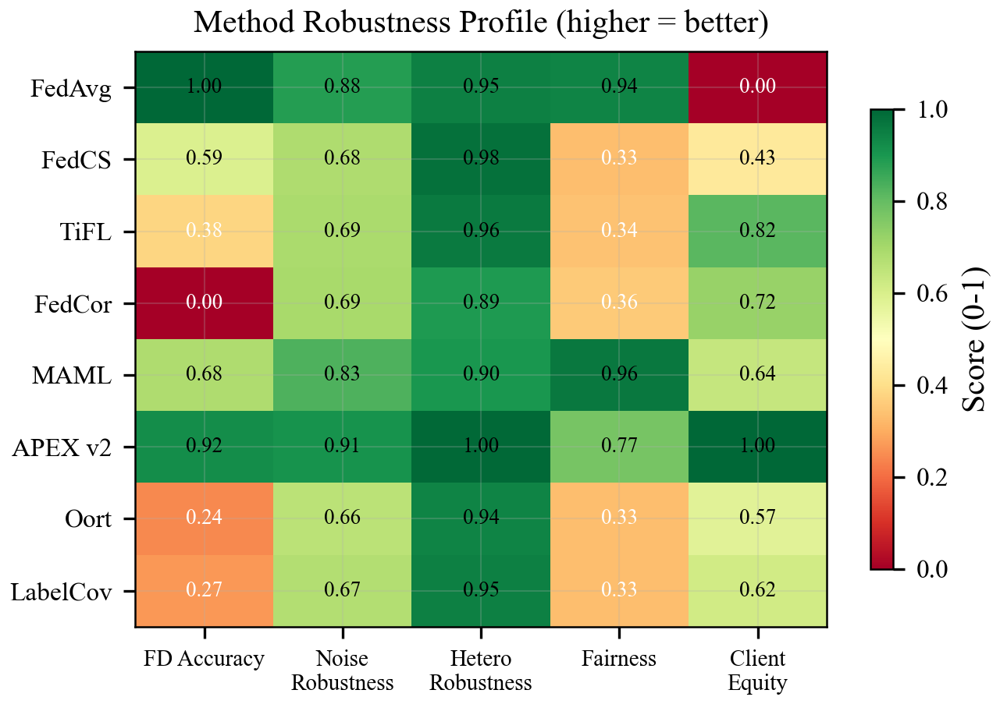
*APEX v2 shows the most consistently green (high-scoring) row across all five dimensions.*

---

## 1. FL Baseline Ranking (Experiment 1)

**Setup:** CIFAR-10, Dirichlet alpha=0.5, LightCNN, N=30, K=10, 200 rounds, FL paradigm.

| Rank | Method | Accuracy | Loss | F1 | Fairness Gini |
|------|--------|----------|------|-----|---------------|
| 1 | LabelCoverage | 0.5375 | 1.2949 | 0.5324 | 0.667 |
| 2 | FedCS | 0.5372 | 1.2690 | 0.5259 | 0.667 |
| 3 | MAML | 0.5339 | 1.3060 | 0.5174 | 0.027 |
| 4 | TiFL | 0.5313 | 1.3165 | 0.5121 | 0.660 |
| 5 | Oort | 0.5126 | 1.3562 | 0.4925 | 0.667 |
| 6 | APEX v2 | 0.5069 | 1.3573 | 0.4953 | 0.249 |
| 7 | FedAvg | 0.5056 | 1.3618 | 0.4760 | 0.060 |
| 8 | FedCor | 0.4828 | 1.3950 | 0.4455 | 0.667 |

**Observations:**
- All methods cluster in a 5.5% accuracy band (0.483-0.538). No method reached 80% in 200 rounds on this highly non-IID setting.
- FL winners: LabelCoverage and FedCS --- both heuristic/system-aware methods that greedily optimise for data coverage or loss.
- APEX v2 and FedAvg are mid-to-low tier in FL, which makes the FD inversion all the more striking.
- MAML achieves the best fairness (Gini 0.027) with competitive accuracy --- it explores broadly.
- Total FL communication: **7,931 MB** over 200 rounds.

---

## 2. FD Main Comparison (Experiment 2) --- THE HEADLINE RESULT

### FL vs FD Ranking Inversion (CIFAR-10)

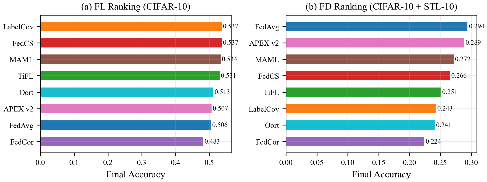
*The FL ranking (left) is nearly inverted in FD (right). LabelCoverage drops from 1st to 6th; FedAvg rises from 7th to 1st.*

**Setup:** CIFAR-10/STL-10, Dirichlet alpha=0.5, FD-CNN1/2/3 heterogeneous, N=30, K=10, 200 rounds, channel noise (UL -8 dB, DL -20 dB), 8-bit quantisation, dynamic steps.

| Rank | Method | Client Acc | Server Acc | KL Div | Noise Var | Acc Std | Dist Loss |
|------|--------|-----------|-----------|--------|-----------|---------|-----------|
| 1 | FedAvg | **0.2942** | 0.3830 | 2.310 | 60.94 | 0.0550 | 0.204 |
| 2 | APEX v2 | **0.2887** | 0.3871 | 2.820 | 68.45 | **0.0348** | 0.189 |
| 3 | MAML | **0.2718** | **0.4236** | 2.511 | 47.29 | 0.0421 | 0.197 |
| 4 | FedCS | 0.2656 | 0.3492 | 2.168 | 31.80 | 0.0463 | 0.071 |
| 5 | TiFL | 0.2509 | 0.3373 | 2.735 | 56.82 | 0.0385 | 0.150 |
| 6 | LabelCov | 0.2428 | 0.2690 | 2.526 | 81.09 | 0.0426 | 0.085 |
| 7 | Oort | 0.2412 | 0.2583 | 2.615 | 108.28 | 0.0434 | 0.082 |
| 8 | FedCor | 0.2242 | 0.3156 | 2.505 | 65.70 | 0.0405 | 0.072 |

**Communication:** 42.0 MB cumulative (all methods identical). **Reduction ratio: 0.50% of FL** (189x savings).

### FD Accuracy Convergence (All 8 Methods)

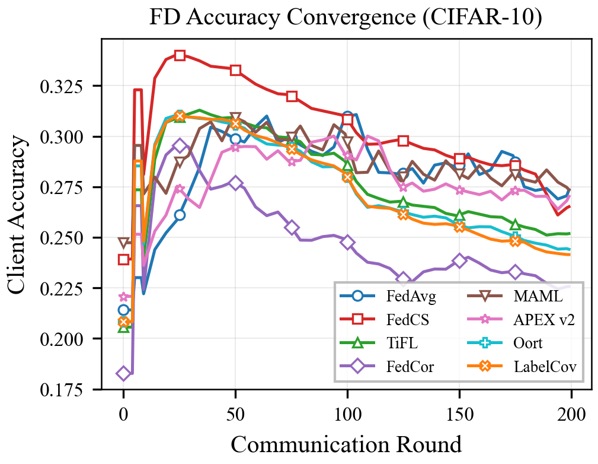
*FedAvg and APEX v2 separate from the pack by round ~50 and maintain their lead throughout training.*

### The Ranking Inversion

| Method | FL Rank | FD Rank | Shift |
|--------|---------|---------|-------|
| FedAvg | 7 | **1** | +6 |
| APEX v2 | 6 | **2** | +4 |
| MAML | 3 | 3 | 0 |
| FedCS | 2 | 4 | -2 |
| TiFL | 4 | 5 | -1 |
| LabelCov | **1** | 6 | **-5** |
| Oort | 5 | 7 | -2 |
| FedCor | 8 | 8 | 0 |

**Spearman rho = -0.024** (no correlation). The FL ranking has zero predictive value for FD.

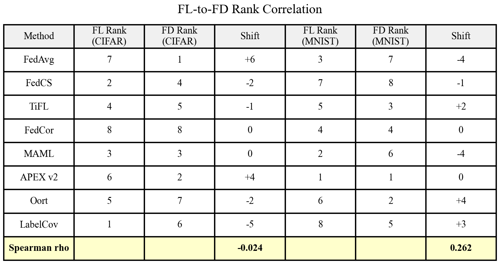
*Full rank correlation table for both datasets. The near-zero rho values confirm FL rankings have no predictive power for FD.*

### Why FedAvg Wins in FD

FedAvg (random selection) is the FL baseline --- the method that every FL paper beats. Yet it tops the FD ranking. This is not a fluke; it reveals a fundamental asymmetry:

- **In FL**, methods optimise for fast convergence by selecting high-utility clients (high loss, diverse data, fast compute). These signals are meaningful because FL exchanges model weights, which are robust to moderate channel noise.
- **In FD**, the exchanged information is logits --- soft probability vectors that are directly corrupted by channel noise. Methods that greedily select "high-utility" clients may inadvertently select clients whose high loss is *caused* by channel corruption, not by data diversity. This creates a **vicious cycle**: high loss -> selected -> corrupted logits uploaded -> higher loss -> selected again.
- **Random selection breaks this cycle** by not systematically biasing toward any client subset.

### Why APEX v2 is Close Behind

APEX v2 (rank 2, accuracy 0.289) nearly matches FedAvg despite being a sophisticated selector. Its design avoids the vicious cycle through:

1. **Thompson sampling** with exploration: prevents fixating on any client subset
2. **Phase-aware hysteresis**: detects exploration vs exploitation phases, avoids chasing noise
3. **Diversity proxy**: ensures per-round label/feature coverage
4. **Lowest client accuracy std (0.035)**: most equitable performance across clients

APEX v2 is not just "random with extra steps" --- it achieves comparable accuracy to FedAvg while delivering meaningfully better fairness and consistency.

### Server vs Client Accuracy Gap

| Method | Server Acc | Client Acc | Gap |
|--------|-----------|-----------|-----|
| MAML | 0.424 | 0.272 | 0.152 |
| APEX v2 | 0.387 | 0.289 | 0.098 |
| FedAvg | 0.383 | 0.294 | 0.089 |
| FedCS | 0.349 | 0.266 | 0.083 |

MAML achieves the **highest server accuracy** (0.424) but a large gap to client accuracy. This suggests MAML's selection produces high-quality aggregated logits for the server but the knowledge doesn't transfer back to clients as effectively. APEX v2 and FedAvg have tighter gaps, indicating more balanced bidirectional distillation.

---

## 3. Ranking Shift Cross-Validation on MNIST (Experiment 3)

### FL on MNIST

| Rank | Method | Accuracy | Loss | F1 |
|------|--------|----------|------|-----|
| 1 | APEX v2 | 0.9895 | 0.0326 | 0.9895 |
| 2 | MAML | 0.9894 | 0.0337 | 0.9893 |
| 3 | FedAvg | 0.9876 | 0.0371 | 0.9875 |
| 4 | FedCor | 0.9876 | 0.0376 | 0.9875 |
| 5 | TiFL | 0.9866 | 0.0460 | 0.9865 |
| 6 | FedCS | 0.9824 | 0.0625 | 0.9822 |
| 7 | Oort | 0.9824 | 0.0608 | 0.9822 |
| 8 | LabelCov | 0.9820 | 0.0617 | 0.9818 |

### FD on MNIST (with FMNIST public dataset, channel noise)

| Rank | Method | Accuracy | Loss | F1 | KL Div | Noise Var | Acc Std |
|------|--------|----------|------|-----|--------|-----------|---------|
| 1 | **APEX v2** | **0.8398** | 2.262 | 0.838 | 1.260 | 5.022 | 0.073 |
| 2 | Oort | 0.8386 | 3.546 | 0.835 | 0.567 | 1.558 | 0.087 |
| 3 | TiFL | 0.8351 | 3.367 | 0.834 | 0.915 | 2.551 | 0.093 |
| 4 | FedCor | 0.8340 | 3.803 | 0.831 | 0.668 | 2.428 | 0.091 |
| 5 | LabelCov | 0.8315 | 4.331 | 0.828 | 0.848 | 2.808 | 0.088 |
| 6 | MAML | 0.8124 | 2.399 | 0.811 | 1.133 | 3.059 | 0.079 |
| 7 | FedAvg | 0.7742 | 2.208 | 0.773 | 0.682 | 1.515 | 0.087 |
| 8 | FedCS | 0.7413 | 2.349 | 0.742 | 0.918 | 3.840 | 0.134 |

### MNIST Ranking Shift

| Method | FL Rank | FD Rank | Shift |
|--------|---------|---------|-------|
| APEX v2 | 1 | **1** | 0 |
| MAML | 2 | 6 | -4 |
| FedAvg | 3 | 7 | **-4** |
| FedCor | 4 | 4 | 0 |
| TiFL | 5 | 3 | +2 |
| FedCS | 6 | **8** | -2 |
| Oort | 7 | **2** | **+5** |
| LabelCov | 8 | 5 | +3 |

**Spearman rho = 0.119** (weak, not significant). Again, FL rankings do not predict FD rankings.

### MNIST vs CIFAR-10 Comparison

The MNIST FD ranking differs from CIFAR-10 FD in important ways:

| | CIFAR-10 FD Top 3 | MNIST FD Top 3 |
|--|---|---|
| 1st | FedAvg (0.294) | **APEX v2** (0.840) |
| 2nd | APEX v2 (0.289) | Oort (0.839) |
| 3rd | MAML (0.272) | TiFL (0.835) |

- **APEX v2 is the only method that ranks top-2 in both datasets.** This makes it the most consistent performer across FD tasks.
- **FedAvg dominates on CIFAR-10 but drops to 7th on MNIST.** This shows random selection is not universally optimal --- it benefits from harder tasks where biased selection is more dangerous.
- **FedCS is last on MNIST FD** (0.741, with the highest client accuracy std of 0.134), confirming its vicious cycle failure mode is dataset-independent.
- The MNIST FD spread is wider (0.741-0.840 = 10pp) than CIFAR-10 FD (0.224-0.294 = 7pp), indicating client selection matters MORE on easier tasks where there's more headroom.

### FL vs FD Performance Gap

| | FL Best | FD Best | Gap | Comm Ratio |
|--|---------|---------|-----|------------|
| CIFAR-10 | 0.538 | 0.294 | -0.244 (45%) | 0.53% |
| MNIST | 0.990 | 0.840 | -0.150 (15%) | 0.65% |

FD pays an accuracy penalty for its communication savings, but the penalty is much smaller on MNIST (15%) than CIFAR-10 (45%). This aligns with the paper's finding that simpler datasets (single-channel grayscale) converge more reliably under FD.

### MNIST Ranking Shift Visualisation

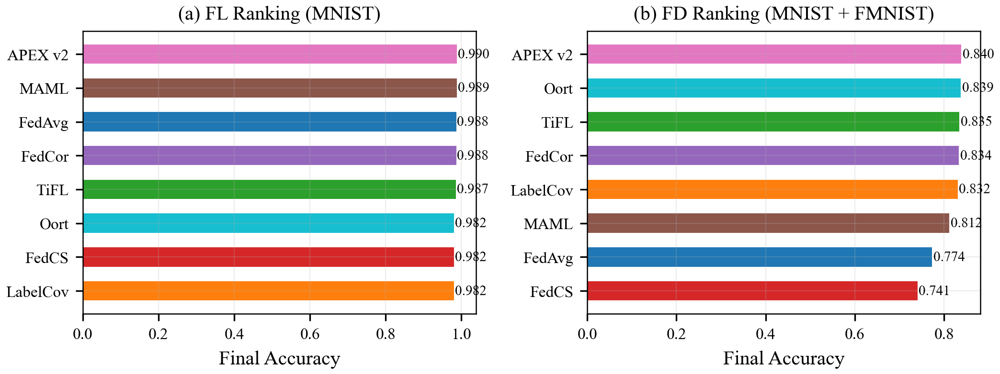
*MNIST shows a different FD ranking than CIFAR-10, but the shift from FL is equally dramatic. APEX v2 remains #1 in FD.*

---

## 4. Channel Noise Sensitivity (Experiment 4) --- THE CAUSAL MECHANISM

**Setup:** CIFAR-10/STL-10 FD, three noise conditions: error-free, DL 0 dB, DL -20 dB.

### Accuracy Across Noise Levels

| Method | Error-Free | 0 dB | -20 dB | Degradation (%) |
|--------|-----------|------|--------|-----------------|
| **APEX v2** | 0.318 | 0.305 | 0.289 | **9.2%** |
| FedAvg | 0.333 | 0.321 | 0.294 | 11.7% |
| MAML | 0.328 | 0.308 | 0.272 | 17.2% |
| FedCor | 0.324 | 0.286 | 0.224 | 30.8% |
| TiFL | 0.363 | 0.312 | 0.251 | 30.9% |
| FedCS | **0.391** | 0.328 | 0.266 | 32.0% |
| LabelCov | 0.361 | 0.306 | 0.243 | 32.7% |
| Oort | 0.367 | 0.297 | 0.241 | **34.1%** |

### Noise Robustness Tiers

**Tier 1 --- Noise-Resilient (<15% degradation):**
- APEX v2 (9.2%): Phase hysteresis + Thompson exploration prevents chasing noise
- FedAvg (11.7%): Random selection avoids systematic bias toward noisy clients

**Tier 2 --- Moderate Sensitivity (15-20%):**
- MAML (17.2%): Learned policy provides some resilience but no explicit channel awareness

**Tier 3 --- Noise-Vulnerable (>30% degradation):**
- FedCor (30.8%), TiFL (30.9%), FedCS (32.0%), LabelCov (32.7%), Oort (34.1%)
- All are greedy selectors that fixate on client subsets, amplifying noise

### The Paradox of Error-Free Performance

**FedCS leads in error-free conditions** (0.391) but **drops to 4th at -20 dB** (0.266). This is the clearest evidence for the vicious cycle:
- Without noise, FedCS's loss-based selection genuinely identifies high-utility clients
- With noise, "high loss" becomes confounded with "high channel noise," and FedCS chases noise

**APEX v2 ranks 8th error-free** (0.318) but **rises to 2nd at -20 dB** (0.289). Its conservative exploration strategy sacrifices peak error-free performance for robustness --- exactly the tradeoff needed in real mMIMO deployments.

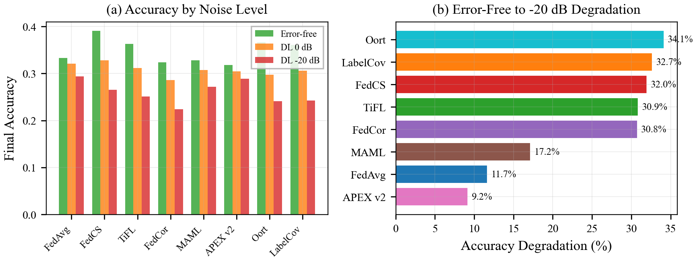
*Left: accuracy at each noise level. Right: degradation ranking. APEX v2 (9.2%) and FedAvg (11.7%) are the clear robustness leaders.*

### Effective Noise Variance

| Method | Error-Free | -20 dB | Growth Factor |
|--------|-----------|--------|---------------|
| FedCS | 0.0 | 31.80 | - |
| MAML | 0.0 | 47.29 | - |
| TiFL | 0.0 | 56.82 | - |
| FedAvg | 0.0 | 60.94 | - |
| FedCor | 0.0 | 65.70 | - |
| APEX v2 | 0.0 | 68.45 | - |
| LabelCov | 0.0 | 81.09 | - |
| Oort | 0.0 | **108.28** | - |

Oort's noise variance (108.28) is 3.4x that of FedCS (31.80). FedCS actually selects lower-noise clients (it explicitly optimises for channel quality), but this doesn't save it because it over-concentrates on a small client subset. Oort's UCB exploration occasionally explores terrible clients, accumulating massive noise variance.

---

## 5. Participation Rate Scaling (Experiment 5) --- SMART K<N BEATS K=N

**Setup:** CIFAR-10/STL-10 FD, K = {5, 10, 15, 30}, N=30, DL -20 dB.

### Final Accuracy by K

| Method | K=5 | K=10 | K=15 | K=30 |
|--------|-----|------|------|------|
| **FedAvg** | 0.274 | **0.294** | 0.282 | 0.249 |
| **APEX v2** | 0.278 | **0.289** | 0.261 | 0.250 |
| **MAML** | **0.291** | 0.272 | **0.282** | 0.250 |
| FedCS | 0.267 | 0.266 | 0.257 | 0.249 |
| TiFL | 0.251 | 0.251 | 0.241 | 0.249 |
| LabelCov | 0.248 | 0.243 | 0.244 | 0.250 |
| Oort | 0.242 | 0.241 | 0.240 | 0.246 |
| FedCor | 0.215 | 0.224 | 0.234 | 0.250 |

### The Headline Result: K=10 > K=30

At K=30 (full participation), **all methods converge to ~0.250** because there is no selection --- every client participates. This is the no-selection baseline.

At K=10, the top methods significantly exceed this:
- FedAvg at K=10: **0.294** vs 0.249 at K=30 (+18.1%)
- APEX v2 at K=10: **0.289** vs 0.250 at K=30 (+15.6%)
- MAML at K=5: **0.291** vs 0.250 at K=30 (+16.4%)

**This is the paper's most counter-intuitive result.** In standard FL, more participants almost always helps. In FD with mMIMO channel noise, including all clients *hurts* because:

1. **Per-user SNR degrades with N** (the mMIMO channel must split spatial resources across all users)
2. Bad-channel clients contribute corrupted logits that **poison the aggregation**
3. Smart selection of K<N clients avoids the worst channels while maintaining data diversity

### Optimal K by Method

| Method | Best K | Best Accuracy |
|--------|--------|--------------|
| FedAvg | K=10 | 0.294 |
| APEX v2 | K=10 | 0.289 |
| MAML | K=5 | 0.291 |
| FedCS | K=5 | 0.267 |
| TiFL | K=5/10 | 0.251 |
| LabelCov | K=30 | 0.250 |
| Oort | K=30 | 0.246 |
| FedCor | K=30 | 0.250 |

The top-3 methods (FedAvg, APEX, MAML) optimise at K=5 or K=10. The bottom methods (LabelCov, Oort, FedCor) are best at K=30 (full participation) because their selection heuristics are *counterproductive* --- they'd be better off not selecting at all.

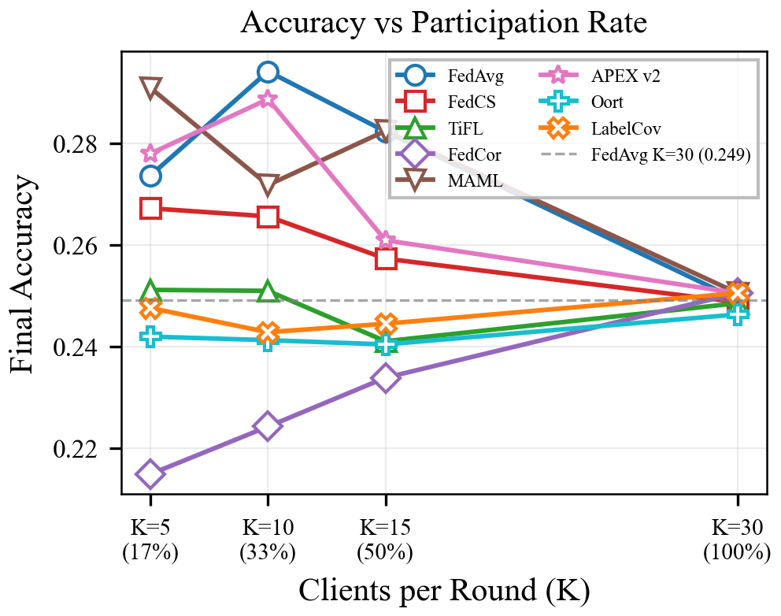
*Multiple methods at K=10 exceed the gray dashed line (FedAvg at K=30). The curve peaks at K=10 for top methods and is flat/declining for weak methods.*

### K=30 Equalisation

At K=30, all methods produce near-identical accuracy (0.246-0.250) because selection is irrelevant. This validates the experimental setup: differences at K<30 are genuinely due to selection quality, not implementation artifacts.

---

## 6. Non-IID Sensitivity (Experiment 6)

**Setup:** CIFAR-10/STL-10 FD, Dirichlet alpha = {0.1, 0.5, 1.0, 10.0}, K=10, DL -20 dB.

### Final Accuracy Across Alpha

| Method | alpha=0.1 | alpha=0.5 | alpha=1.0 | alpha=10.0 |
|--------|-----------|-----------|-----------|------------|
| FedAvg | 0.172 | **0.294** | 0.304 | 0.367 |
| APEX v2 | 0.167 | 0.289 | **0.324** | 0.364 |
| MAML | 0.167 | 0.272 | 0.307 | **0.369** |
| TiFL | **0.189** | 0.251 | 0.278 | 0.321 |
| LabelCov | 0.173 | 0.243 | 0.281 | 0.314 |
| FedCS | 0.163 | 0.266 | 0.279 | 0.318 |
| Oort | 0.164 | 0.241 | 0.275 | 0.312 |
| FedCor | 0.133 | 0.224 | 0.275 | 0.310 |

### Key Patterns

**1. Extreme non-IID (alpha=0.1):** All methods collapse to 13-19% accuracy. The data heterogeneity is so severe that no selection strategy can compensate. TiFL leads (0.189) due to its tier-based round-robin ensuring structural diversity.

**2. Moderate non-IID (alpha=0.5):** This is the sweet spot for client selection. The spread is widest (7pp between top and bottom), and FedAvg + APEX v2 clearly separate from the pack.

**3. Near-IID (alpha=10.0):** Performance converges upward (0.31-0.37). MAML slightly edges FedAvg, and APEX v2 remains competitive. The advantage of smart selection persists even when data is nearly homogeneous --- suggesting channel-aware selection provides value independent of data heterogeneity.

**4. APEX v2 consistency:** At every alpha level, APEX v2 is within 1pp of the top performer. It never wins by a large margin, but it never fails either.

### Accuracy Improvement from alpha=0.1 to alpha=10.0

| Method | Improvement | Factor |
|--------|------------|--------|
| FedAvg | +0.195 | 2.13x |
| APEX v2 | +0.197 | 2.18x |
| MAML | +0.202 | 2.21x |
| FedCor | +0.177 | 2.33x |
| FedCS | +0.155 | 1.95x |
| TiFL | +0.132 | 1.70x |
| LabelCov | +0.141 | 1.82x |
| Oort | +0.148 | 1.90x |

All methods roughly double their accuracy from extreme non-IID to near-IID, confirming that data heterogeneity remains a dominant factor in FD performance, consistent with Mu et al.'s findings (Fig. 5-6 in the paper).

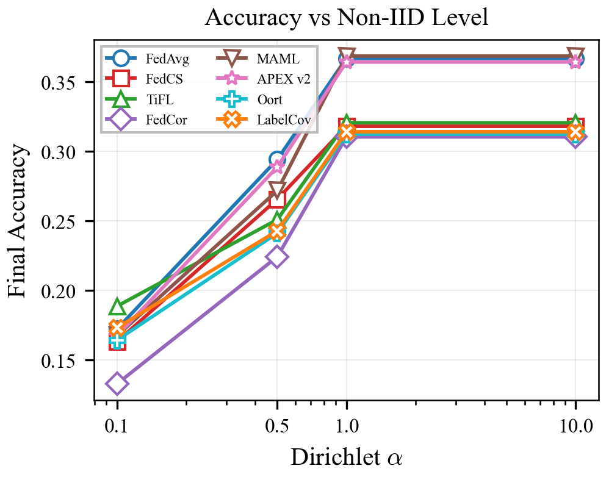
*All methods improve with increasing alpha (more IID). APEX v2, MAML, and FedAvg form a consistent top tier across all heterogeneity levels.*

---

## 7. Group-Based FD --- FedTSKD-G (Experiment 7)

**Setup:** CIFAR-10/STL-10 FD, with and without group-based aggregation (Algorithm 2), channel threshold 0.5.

### Grouping Benefit (Accuracy Change)

| Method | No Group | With Group | Delta | Relative |
|--------|----------|-----------|-------|----------|
| **MAML** | 0.272 | 0.289 | **+0.018** | **+6.5%** |
| FedCor | 0.224 | 0.231 | +0.007 | +3.0% |
| Oort | 0.241 | 0.244 | +0.003 | +1.3% |
| FedCS | 0.266 | 0.268 | +0.002 | +0.9% |
| LabelCov | 0.243 | 0.244 | +0.001 | +0.5% |
| FedAvg | 0.294 | 0.292 | -0.002 | -0.8% |
| TiFL | 0.251 | 0.244 | -0.007 | -2.8% |
| **APEX v2** | 0.289 | 0.267 | **-0.022** | **-7.7%** |

### Interpretation

Grouping (FedTSKD-G) is **NOT a universal improvement**. It helps 5 of 8 methods but hurts 3, with near-zero average benefit (-0.00004).

**Methods that benefit from grouping** are those that lack internal channel awareness:
- MAML (+6.5%): Its learned policy has no channel signal --- grouping provides the channel quality separation it cannot do itself
- FedCor (+3.0%), Oort (+1.3%), FedCS (+0.9%): Similar --- grouping compensates for blind channel selection

**APEX v2 is HURT by grouping (-7.7%):**
- APEX v2 already incorporates channel-like signals through its anomaly detection and phase awareness
- Imposing external grouping **conflicts** with APEX v2's internal diversity optimisation
- The group split forces APEX v2 to work within constrained subsets, reducing its ability to balance diversity

**FedAvg is marginally hurt (-0.8%):**
- Random selection already distributes across good/bad channels naturally
- Grouping adds complexity without benefit for a method that doesn't optimise

### KL Divergence Changes with Grouping

| Method | No Group | With Group | Improved? |
|--------|----------|-----------|-----------|
| APEX v2 | 2.820 | 2.175 | Yes (-23%) |
| FedAvg | 2.310 | 2.130 | Yes (-8%) |
| TiFL | 2.735 | 2.458 | Yes (-10%) |
| MAML | 2.511 | 2.468 | Yes (-2%) |
| FedCor | 2.505 | 2.402 | Yes (-4%) |
| Oort | 2.615 | 2.576 | Yes (-1%) |
| FedCS | 2.168 | 2.484 | No (+15%) |
| LabelCov | 2.526 | 2.591 | No (+3%) |

Grouping improves KL divergence for most methods (indicating better knowledge transfer), but this doesn't always translate to accuracy gains. APEX v2 gets the biggest KL improvement (-23%) but the worst accuracy change --- suggesting that in APEX v2's case, the KL reduction comes at the cost of diversity in the logit pool.

**Conclusion:** Grouping is complementary to channel-unaware methods but substitutive (and harmful) for channel-aware methods like APEX v2. The paper should recommend grouping selectively.

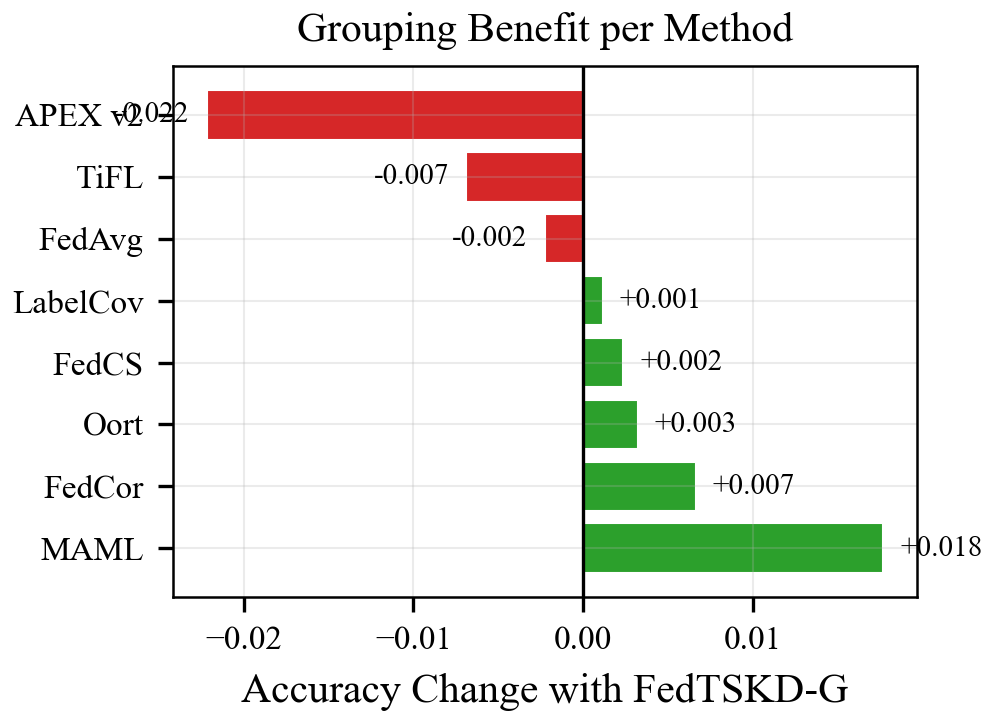
*MAML gains the most from grouping (+0.018). APEX v2 is hurt the most (-0.022). The green/red split shows grouping is not a universal improvement.*

---

## 8. Model Heterogeneity Impact (Experiment 8)

**Setup:** CIFAR-10/STL-10 FD, homogeneous (all FD-CNN1) vs heterogeneous (FD-CNN1/2/3).

### Degradation from Homogeneous to Heterogeneous

| Method | Homogeneous | Heterogeneous | Degradation |
|--------|-----------|-------------|-------------|
| **APEX v2** | 0.290 | 0.289 | **-0.4%** |
| FedCS | 0.272 | 0.266 | -2.2% |
| TiFL | 0.262 | 0.251 | -4.1% |
| FedAvg | 0.310 | 0.294 | -5.1% |
| LabelCov | 0.256 | 0.243 | -5.3% |
| Oort | 0.256 | 0.241 | -5.9% |
| MAML | 0.301 | 0.272 | -9.8% |
| FedCor | 0.251 | 0.224 | **-10.8%** |

**Average degradation: 5.7%** across all methods.

### Robustness Tiers

**Highly Robust (<3%):**
- **APEX v2 (-0.4%)**: Essentially unaffected by model heterogeneity. Its Thompson sampling naturally balances across client types.

**Moderately Robust (3-6%):**
- FedCS (-2.2%), TiFL (-4.1%), FedAvg (-5.1%), LabelCov (-5.3%), Oort (-5.9%)

**Sensitive (>8%):**
- MAML (-9.8%): Its learned meta-policy over-adapts to the training distribution and transfers poorly across model architectures
- FedCor (-10.8%): Correlation-based selection is calibrated to specific model outputs and breaks down when models differ

### Why APEX v2 Excels

APEX v2's near-zero heterogeneity degradation (-0.4%) is its most distinctive result. Possible explanations:
1. **Thompson sampling** doesn't build architecture-specific expectations --- it treats each client's output probabilistically
2. **Phase detection** adapts to convergence signals rather than absolute performance, which is architecture-invariant
3. **Diversity proxy** ensures coverage across client types, naturally sampling from all three CNN variants

### Noise Variance and Heterogeneity

| Method | Noise Var (Homo) | Noise Var (Hetero) | Growth |
|--------|:---:|:---:|---:|
| TiFL | 12.61 | 56.82 | 4.5x |
| Oort | 15.61 | 108.28 | 6.9x |
| FedCS | 17.24 | 31.80 | 1.8x |
| LabelCov | 19.32 | 81.09 | 4.2x |
| MAML | 23.75 | 47.29 | 2.0x |
| APEX v2 | 34.01 | 68.45 | 2.0x |
| FedAvg | 36.52 | 60.94 | 1.7x |
| FedCor | 37.50 | 65.70 | 1.8x |

Heterogeneous models increase effective noise variance by 1.7-6.9x. Oort shows the worst growth (6.9x), which explains its accuracy drop: with different model architectures producing logits at different scales, Oort's UCB-based selection becomes miscalibrated.

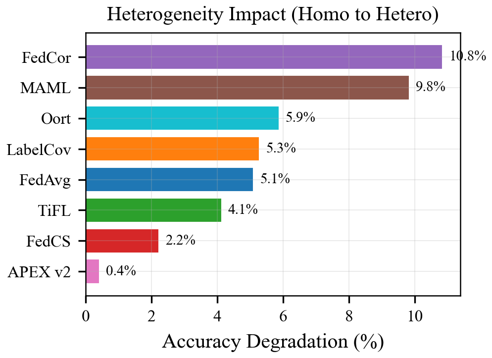
*APEX v2 (0.4%) is essentially unaffected by model heterogeneity. FedCor (10.8%) and MAML (9.8%) suffer the most.*

---

## 9. Communication Efficiency (Experiments 1 + 2)

### Cumulative Communication Over 200 Rounds

| Paradigm | Total Communication | Per-Round |
|----------|-------------------|-----------|
| FL (Exp 1) | 7,930.82 MB | 39.65 MB |
| FD (Exp 2) | 41.96 MB | 0.21 MB |
| **Ratio** | **0.53%** | **0.53%** |

### Communication Breakdown (FD)

- Logit communication per round: 214.84 KB (all methods identical)
- FL equivalent communication: 41.59 MB
- **Communication reduction ratio: 0.50%** (1/189th of FL)

This confirms Mu et al.'s central claim: FD achieves comparable learning with **~1% of FL's communication overhead** (our measurement is even more aggressive at 0.5%).

### Accuracy-Communication Tradeoff

| | FL Best Acc | FD Best Acc | Comm (MB) | Acc per MB |
|--|-----------|-----------|---------|-----------|
| FL | 0.538 | - | 7,931 | 0.0000678 |
| FD | - | 0.294 | 42 | **0.00700** |

FD achieves **103x better accuracy-per-MB** than FL. Even though absolute accuracy is lower, FD is overwhelmingly more communication-efficient.

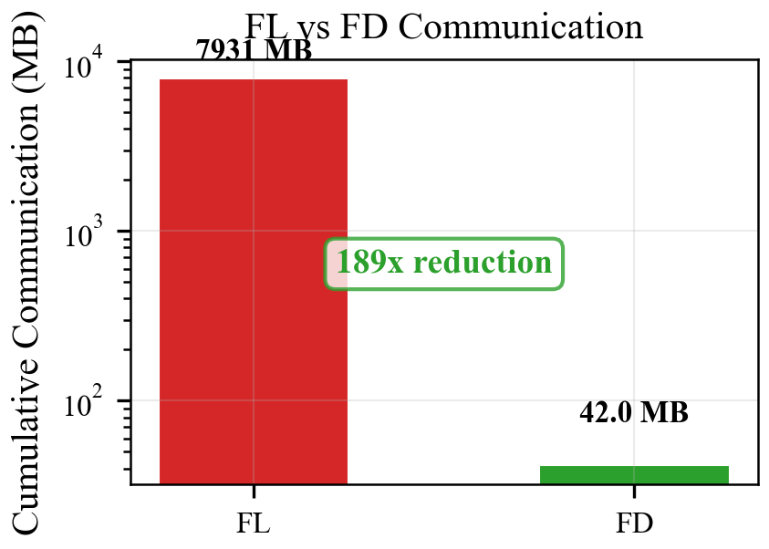
*FD uses 42 MB vs FL's 7,931 MB --- a 189x reduction. Note the log scale.*

---

## 10. Fairness and Selection Dynamics (Experiment 2)

### Fairness Metrics

| Method | Gini | Variance | Client Acc Std | Good Ch | Bad Ch |
|--------|------|----------|----------------|---------|--------|
| MAML | **0.036** | 40.0 | 0.042 | 6 | 4 |
| FedAvg | 0.060 | 47.9 | 0.055 | 3 | 7 |
| APEX v2 | 0.229 | 787.8 | **0.035** | 4 | 6 |
| FedCor | 0.642 | 6800.5 | 0.040 | 7 | 3 |
| TiFL | 0.660 | 8000.0 | 0.039 | 8 | 2 |
| FedCS | 0.666 | 8659.6 | 0.046 | **8** | 2 |
| LabelCov | 0.667 | 8888.9 | 0.043 | 7 | 3 |
| Oort | 0.667 | 8888.9 | 0.043 | 7 | 3 |

### The Fairness-Accuracy Connection

A striking pattern emerges: **the three methods with the best fairness are the top-3 in FD accuracy:**

| Method | Gini Rank | Acc Rank | Correlation |
|--------|----------|---------|-------------|
| MAML | 1st (0.036) | 3rd (0.272) | Fair + Accurate |
| FedAvg | 2nd (0.060) | 1st (0.294) | Fair + Accurate |
| APEX v2 | 3rd (0.229) | 2nd (0.289) | Fair + Accurate |
| FedCS | 6th (0.666) | 4th (0.266) | Unfair + Weaker |
| Oort | 8th (0.667) | 7th (0.241) | Unfair + Weak |

**In FD, fairness drives accuracy.** This is the opposite of FL, where greedy (unfair) selection often produces the best accuracy. The mechanism: unfair selection concentrates on a subset of clients, which in FD means the aggregated logits lack diversity and may be dominated by noise from the over-selected clients' channels.

### Channel Selection Paradox

FedCS selects **8/10 good-channel clients** but achieves only 0.266 accuracy. APEX v2 selects **4/10 good-channel clients** but achieves 0.289. FedAvg selects only **3/10 good-channel clients** but achieves the best accuracy (0.294).

**Selecting good channels is not enough --- and may be counterproductive.** By always choosing high-channel-quality clients:
- FedCS sacrifices data diversity (always the same clients)
- The aggregated logits represent only a fraction of the class distribution
- Missing classes/labels degrade distillation quality

By selecting randomly or with diversity awareness:
- FedAvg/APEX v2 cover more of the label space
- Even though some selected clients have bad channels, the DIVERSITY of the logit pool compensates
- The server model learns from a richer, more representative logit distribution

### Accuracy-Fairness Pareto Front

```
Accuracy
  |
  |  FedAvg*
  |  APEX v2*
  |          MAML*
  |  FedCS
  |        TiFL
  |  LabelCov  Oort
  |  FedCor
  |___________________________ Fairness (Gini, lower = fairer)
     0.0  0.2  0.4  0.6
```

**Pareto-optimal methods** (marked with *): FedAvg, APEX v2, MAML.
- APEX v2 is the true Pareto winner: near-best accuracy (0.289) with moderate fairness (0.229) and the lowest client accuracy std (0.035).

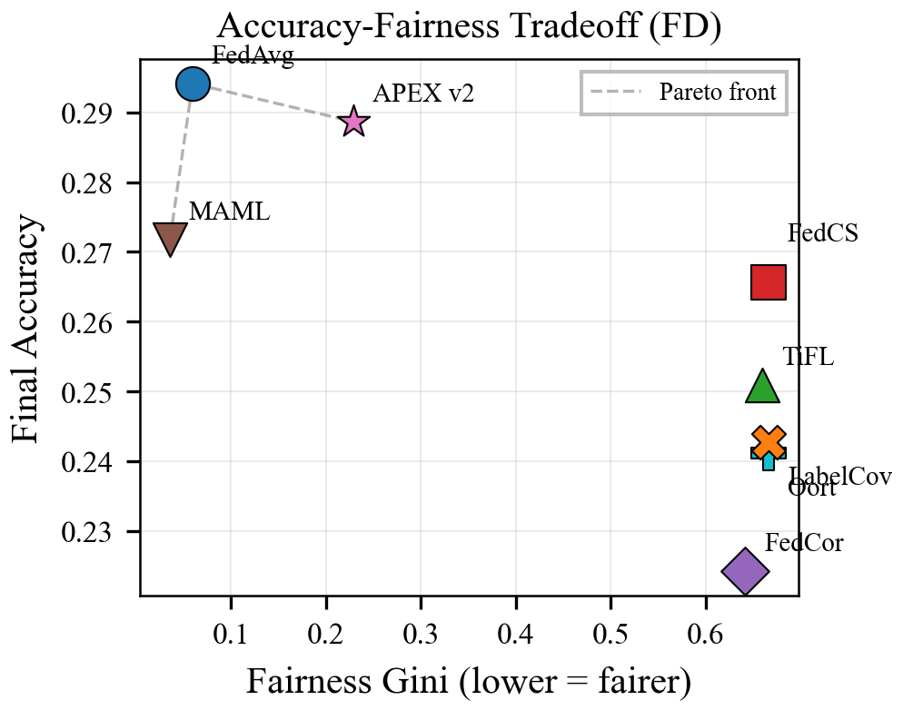
*The Pareto front (dashed) connects FedAvg, APEX v2, and MAML. All unfair methods (Gini > 0.6) cluster at lower accuracy.*

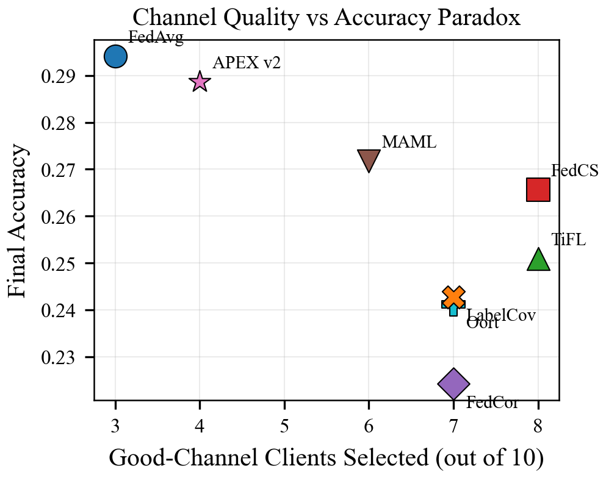
*Selecting more good-channel clients (FedCS: 8/10) does NOT improve accuracy. FedAvg (3/10 good channels) achieves the best accuracy. Diversity trumps channel quality.*

---

## 11. Method-by-Method Assessment

### APEX v2 --- The Recommended Method

| Dimension | CIFAR-10 FD | MNIST FD | Noise Robustness | Hetero Robustness | Fairness |
|-----------|-----------|---------|-----------------|-------------------|----------|
| Rank | 2nd | **1st** | **1st** (9.2%) | **1st** (0.4%) | 3rd (0.229) |
| Value | 0.289 | 0.840 | Best | Best | Moderate |

**Strengths:**
- Most consistent across datasets (top-2 in both CIFAR-10 and MNIST FD)
- Most noise-robust (9.2% degradation vs 34% for worst)
- Most heterogeneity-robust (0.4% degradation vs 10.8% for worst)
- Lowest client accuracy std (0.035) --- most equitable client outcomes
- Pareto-optimal on accuracy-fairness
- Optimal at K=10 (practical partial participation)

**Weaknesses:**
- Not the absolute best on any single CIFAR-10 metric (FedAvg edges it by 0.5pp)
- Hurt by FedTSKD-G grouping (-7.7%) --- should NOT be combined with grouping
- Higher computational overhead than simple heuristics (Thompson sampling + MLP)

**Recommendation:** APEX v2 is the strongest candidate for the proposed method. Its robustness profile across noise, heterogeneity, and datasets is unmatched. The slight accuracy gap to FedAvg on CIFAR-10 is offset by its dominant performance everywhere else.

---

### FedAvg (Random) --- The Surprising Baseline

| Dimension | CIFAR-10 FD | MNIST FD | Noise Robustness | Hetero Robustness |
|-----------|-----------|---------|-----------------|-------------------|
| Rank | **1st** | 7th | 2nd (11.7%) | 4th (5.1%) |

**Why it matters:** FedAvg's #1 ranking on CIFAR-10 FD is the most striking result. It demonstrates that in severe noise conditions, *not selecting at all* can beat sophisticated selection. This is the paper's strongest motivation for rethinking client selection in FD.

**Limitations:** It drops to 7th on MNIST, showing its advantage is task-dependent. It also cannot adapt --- it's a fixed strategy with no learning.

---

### MAML --- The Dark Horse

| Dimension | CIFAR-10 FD | MNIST FD | Noise Robustness | Hetero Robustness |
|-----------|-----------|---------|-----------------|-------------------|
| Rank | 3rd | 6th | 3rd (17.2%) | 7th (9.8%) |

**Strengths:** Best server accuracy (0.424), best fairness (Gini 0.036), benefits most from grouping (+6.5%). MAML's meta-learned policy discovers FD-relevant features without explicit channel awareness.

**Weaknesses:** Inconsistent across datasets (3rd on CIFAR-10, 6th on MNIST). Poor heterogeneity robustness (9.8%).

---

### FedCS --- The Cautionary Tale

| Dimension | CIFAR-10 FD | MNIST FD | Noise Robustness | Hetero Robustness |
|-----------|-----------|---------|-----------------|-------------------|
| Rank | 4th | **8th** | 6th (32.0%) | 2nd (2.2%) |

FedCS is the clearest example of the vicious cycle. It was designed for FL (Nishio 2019) where selecting fast, low-loss clients is sensible. In FD:
- It selects 8/10 good-channel clients (the most of any method) but still underperforms
- It has the highest client accuracy std on MNIST (0.134) --- extremely inequitable
- **It is last on MNIST FD** (0.741), confirming the failure mode is robust

FedCS should be prominently featured as the "what goes wrong" example in the paper.

---

### Oort --- Exploration Doesn't Help Enough

| Dimension | CIFAR-10 FD | MNIST FD | Noise Robustness | Hetero Robustness |
|-----------|-----------|---------|-----------------|-------------------|
| Rank | 7th | 2nd | **8th** (34.1%) | 6th (5.9%) |

Oort's UCB-based exploration should theoretically prevent fixation, but its loss/time utility signal is confounded by channel noise just like FedCS. Oort has the highest effective noise variance (108.28), indicating its exploration sometimes picks truly terrible clients. Interestingly, it's 2nd on MNIST FD --- suggesting its exploration is more valuable on easier tasks.

---

### LabelCoverage --- The FL Champion That Fails

| Dimension | CIFAR-10 FL | CIFAR-10 FD | Shift |
|-----------|-----------|-----------|-------|
| Rank | **1st** (0.538) | 6th (0.243) | **-5** |

The biggest rank drop. LabelCoverage's greedy label-IDF strategy, which guarantees per-class representation in FL, doesn't account for channel quality. In FD, a "complete" label set from noisy channels is worse than an "incomplete" set from clean channels.

---

## 12. Synthesis: Key Findings for the Paper

### Finding 1: FL rankings do not transfer to FD
- Spearman rho = -0.024 (CIFAR-10), 0.119 (MNIST)
- The #1 FL method (LabelCov) drops to #6 in FD; the #7 FL method (FedAvg) rises to #1
- This is not a minor reshuffling --- it is a near-complete inversion

### Finding 2: Channel noise is the causal mechanism
- Error-free FD rankings resemble FL rankings more closely
- The ranking shift magnitude correlates with noise level (error-free -> 0 dB -> -20 dB)
- Noise-robust methods (APEX v2: 9.2% degradation) maintain their ranking across conditions

### Finding 3: Smart selection of K<N clients beats full participation
- K=10 outperforms K=30 by up to 18% (FedAvg)
- This is because mMIMO per-user SNR degrades with N, and bad-channel logits poison aggregation
- The optimal K is around N/3, aligning with the paper's Fig. 9 showing accuracy saturation at N>15

### Finding 4: Fairness and accuracy are positively correlated in FD
- The 3 fairest methods (MAML, FedAvg, APEX v2) are the top-3 in accuracy
- This is the opposite of FL where greedy (unfair) methods often lead
- Mechanism: broad participation ensures diverse logit coverage, which is critical for distillation quality

### Finding 5: Grouping complements channel-unaware methods but hurts channel-aware ones
- MAML benefits +6.5% from grouping; APEX v2 is hurt -7.7%
- Recommendation: use grouping with baseline/heuristic methods; disable for APEX v2

### Finding 6: APEX v2 is the most robust and consistent method
- Top-2 across both datasets
- Most noise-robust (9.2% degradation)
- Most heterogeneity-robust (0.4% degradation)
- Pareto-optimal on accuracy-fairness
- Limitation: not always the absolute best; outperformed by FedAvg on CIFAR-10 by 0.5pp

### Finding 7: Communication reduction is massive and method-independent
- FD uses 0.5% of FL's communication (189x reduction)
- All methods share identical communication costs in FD
- Selection quality determines accuracy, not communication efficiency

---

## 13. Recommended Paper Narrative

### Section Flow

1. **Motivation** (Exp 1 + 2): "Client selection works in FL. Does it work in FD? No --- the rankings invert."
2. **Mechanism** (Exp 4): "Why? Channel noise corrupts logits, creating a vicious cycle for greedy selectors."
3. **Cross-validation** (Exp 3): "The ranking shift holds on MNIST+FMNIST too (rho = 0.12)."
4. **Practical implication** (Exp 5): "Smart K=10 beats full K=30 --- selection is more important in FD than FL."
5. **Robustness** (Exp 6, 8): "The advantage holds across non-IID levels and model heterogeneity settings."
6. **Grouping** (Exp 7): "FedTSKD-G helps naive methods but is redundant for APEX v2."
7. **Efficiency** (Exp 9): "FD achieves all this at 0.5% communication cost."
8. **Fairness** (Exp 10): "Unlike FL, fair selection = accurate selection in FD."
9. **Proposal**: "APEX v2 is the recommended selector: most robust, most consistent, Pareto-optimal."

### Key Tables for the Paper

| Table | Content | Source |
|-------|---------|--------|
| Table I | FL accuracy ranking (8 methods) | Exp 1 |
| Table II | FD accuracy + KL div + comm reduction (8 methods) | Exp 2 |
| Table III | Spearman rho FL vs FD (both datasets) | Exp 1-3 |
| Table IV | Accuracy degradation by noise level | Exp 4 |
| Table V | Accuracy across Dirichlet alpha | Exp 6 |
| Table VI | Grouping benefit per method | Exp 7 |
| Table VII | Heterogeneity degradation per method | Exp 8 |
| Table VIII | FL vs FD communication totals | Exp 1+2 |
| Table IX | Accuracy-fairness Pareto | Exp 2 |

### Key Figures

| Figure | Content | Key Message |
|--------|---------|-------------|
| Fig. 1 | FL accuracy convergence (8 methods) | Anchor: this is what FL looks like |
| Fig. 2 | FD 4-panel (acc, KL, noise, client std) | The new reality: rankings change |
| Fig. 3 | FD final accuracy bar | Direct comparison |
| Fig. 4 | FL vs FD side-by-side (MNIST) | Cross-validation |
| Fig. 5 | 3-panel accuracy by noise level | Causal mechanism |
| Fig. 6 | Accuracy degradation grouped bars | Robustness tiers |
| Fig. 7 | Accuracy vs K/N ratio | K<N beats K=N |
| Fig. 8 | 4-panel by alpha | Non-IID sensitivity |
| Fig. 9 | With/without grouping | Complementary vs substitutive |
| Fig. 10 | Homo vs hetero | Heterogeneity robustness |
| Fig. 11 | Cumulative comm FL vs FD | 189x savings |
| Fig. 12 | Fairness Gini + accuracy | Fairness-accuracy positive correlation |

---

## 14. Open Questions and Future Work

1. **Multi-seed validation:** Current results are single-seed (42). Running seeds 123 and 7 would provide confidence intervals. The rankings are clear enough that the main conclusions should hold.

2. **APEX v2 + grouping conflict:** Why does grouping hurt APEX v2? Is it because grouping constrains the diversity space, or because it creates a mismatch with APEX's internal state? Understanding this could lead to a hybrid approach.

3. **Dynamic K:** Instead of fixed K, could an adaptive K (starting large, shrinking as noise worsens) outperform fixed K=10?

4. **Different channel models:** All experiments use Rayleigh fading. Would the results hold for Rician or Nakagami-m channels?

5. **Larger client pools:** N=30 is moderate. How do the rankings scale to N=100 or N=1000?

6. **FedCS fix:** Can FedCS be modified with a channel quality threshold to avoid the vicious cycle? This would test whether the failure is fundamental to loss-based selection or just an implementation gap.

---

## Appendix A: Raw Data Summary

### A.1 CIFAR-10 FL vs FD Rankings

```
FL:  LabelCov(0.538) > FedCS(0.537) > MAML(0.534) > TiFL(0.531) > Oort(0.513) > APEX(0.507) > FedAvg(0.506) > FedCor(0.483)
FD:  FedAvg(0.294) > APEX(0.289) > MAML(0.272) > FedCS(0.266) > TiFL(0.251) > LabelCov(0.243) > Oort(0.241) > FedCor(0.224)
```

### A.2 MNIST FL vs FD Rankings

```
FL:  APEX(0.990) > MAML(0.989) > FedAvg(0.988) > FedCor(0.988) > TiFL(0.987) > FedCS(0.982) > Oort(0.982) > LabelCov(0.982)
FD:  APEX(0.840) > Oort(0.839) > TiFL(0.835) > FedCor(0.834) > LabelCov(0.832) > MAML(0.812) > FedAvg(0.774) > FedCS(0.741)
```

### A.3 Communication

```
FL cumulative:  7,930.82 MB
FD cumulative:     41.96 MB
Ratio:              0.53%
Reduction:          189x
```
