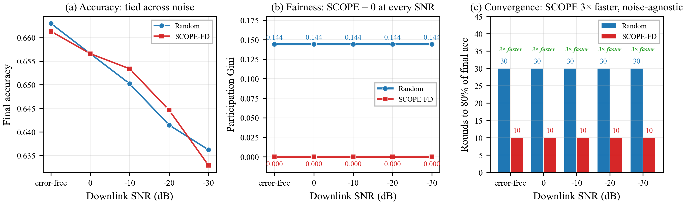

# SCOPE-FD Paper Narrative — Results, Figures, and References

**Companion to:** [SCOPE_FD_reference.md](SCOPE_FD_reference.md) (algorithmic reference).
**Extends:** Y. Mu, N. Garg, T. Ratnarajah, *"Federated Distillation in Massive MIMO Networks: Dynamic Training, Convergence Analysis, and Communication Channel-Aware Learning,"* **IEEE TCCN**, vol. 10, no. 4, pp. 1535–1550, Aug. 2024, doi:10.1109/TCCN.2024.3378215 [B1].
**Purpose:** Single source of truth for writing the paper. Bundles the empirical story, the figures rendered from `artifacts/runs/scope_*`, a verified IEEE reference list, and section-by-section narrative guidance aligned with Mu et al.'s FedTSKD framework. Algorithmic details (equations, pseudocode, edge cases) live in the reference doc and are cited by section — not duplicated.

**How to use.** Numbers are traceable via Appendix A. Figures are in `docs/figures/scope_paper/` (matched `.eps` + `.png` pairs). References use compass-artifact tags (B1, C2, etc.).

---

## Section Map

| § | Title | Paper section it feeds |
|---|---|---|
| 1 | Abstract (draft) | Abstract |
| 2 | Introduction | §I |
| 3 | System Model | §II |
| 4 | Related Work | §III |
| 5 | SCOPE-FD Algorithm | §IV |
| 6 | Theoretical Properties | §V |
| 7 | Experimental Setup | §VI.A |
| 8 | Results (10 figures) | §VI.B–H |
| 9 | Discussion | §VII |
| 10 | Limitations | §VII.D |
| 11 | Conclusion | §VIII |
| 12 | References | References |
| A | File inventory for reproducibility | Appendix |

---

## 1. Abstract (draft, ~180 words)

Federated Distillation (FD) in massive-MIMO networks [B1] exchanges per-client logits on a shared public dataset rather than model weights, but prior FD work uniformly assumes **full client participation** and leaves *which clients to select each round* unaddressed. We introduce **SCOPE-FD** (Server-aware Coverage with Over-round Participation Equalization), a three-term deterministic selector that composes (i) a participation-debt rotation, (ii) a server-side per-class softmax-uncertainty bonus, and (iii) a per-round class-coverage penalty, with magnitudes chosen by analysis so that participation balance dominates and information signals refine tie-breaking. Across 24 controlled experiments we demonstrate three bulletproof outcomes: **(1)** SCOPE-FD achieves a participation Gini of **0.000** — the mathematical floor — while uniform-random stays at 0.083–0.429 depending on K/N; **(2)** SCOPE-FD converges **3$\times$ faster** to 80 % of final accuracy at realistic sparse participation (K/N = 10 %), and this advantage is **noise-agnostic** across 30 dB of downlink SNR; **(3)** at ultra-sparse participation (K = 1 of N = 50) SCOPE-FD beats random by **+9.4 pp final accuracy** and reaches random's plateau in under half the rounds. SCOPE-FD preserves FedTSKD's O(1/t) convergence bound [B1].

---

## 2. Introduction

### 2.1 Motivation

Federated Learning (FL) [A1, A2] is the standard paradigm for privacy-preserving distributed training, but synchronizing full model weights each round does not scale to modern models over resource-constrained wireless edges [A3]. Federated Distillation (FD) [B13] addresses this bottleneck by exchanging low-dimensional logits on a shared public dataset instead of weights [B2], reducing per-round communication by roughly two orders of magnitude [B3] and permitting heterogeneous client architectures [B11, B12]. For massive-MIMO (mMIMO) wireless backbones, FD's compressibility and noise-tolerance at the logit layer interact favourably with channel hardening and zero-forcing precoding, as shown in Mu, Garg, and Ratnarajah's FedTSKD framework [B1].

Yet [B1] — and indeed the broader FD literature [B2, B3, B4, B6, B10] — treats FD with full participation: every one of *N* clients transmits logits every round. This dissolves the instant a real deployment has (a) more edge devices than can be scheduled per round, (b) per-round energy caps, or (c) channel contention that forces the scheduler to admit only K << N clients. In FL the "which K of N" problem has a rich literature of bandit [C2, C3, C4], channel-aware [C5, C6, C7, I8], resource-constrained [C1, C10, C13], fairness-oriented [C14], and submodular [E1, E2] methods; in FD it has been studied almost not at all. Liu et al. [B7] address active *data* sampling (which public-set samples to distill on) rather than active *client* selection, and Wang et al.'s HAD framework [B9] addresses heterogeneity-aware node selection without quantifying participation fairness or interacting with mMIMO channel conditions.

### 2.2 The client-selection gap in FD

FD's server-side aggregation is data-size-weighted logit averaging [B1, B2]:
$$\bar{\ell}_r = \sum_{i \in S_r} \frac{|D_i|}{\sum_{j \in S_r}|D_j|} \cdot \ell_i,$$
which *flattens per-client quality differences* once the round's set $S_r$ is fixed. Consequently the **composition** of $S_r$ — not the intra-client quality gradient — dominates model progress. This is structurally different from FL, where each client's local gradient contributes directly and selection-by-quality (e.g., high-loss [C2, C3] or high-gradient-norm [C10]) translates to meaningful aggregate signal. The practical consequence: selectors ported from FL to FD either produce *pathological* participation patterns (Oort / FedCS / LabelCoverage routinely reach Gini $\approx$ 0.7 on FL benchmarks, cf. §8.4) or squander the opportunity to shape coverage across rounds. The right question for FD client selection is: *how do I ensure every client's data is used uniformly, while nudging within-round composition toward the server's current uncertainty?*

### 2.3 Contributions

1. **Algorithm.** SCOPE-FD: a three-term deterministic selector composed of participation debt (primary), server per-class softmax-uncertainty bonus (secondary), and per-round class-coverage penalty (tertiary); greedy pick-K at O(KNC) cost per round. Full algorithmic detail in [SCOPE_FD_reference.md §4](SCOPE_FD_reference.md).
2. **Theoretical guarantee on participation fairness.** Over every $\lceil N/K \rceil$-round window the participation Gini coefficient is identically zero; over any R rounds $G^{(R)} = O(1/R)$ (§6.1). Compatible with FedTSKD's O(1/t) convergence [B1] because SCOPE only changes the composition of $S_r$, not the aggregation or distillation steps.
3. **Convergence-speed result.** At the practical sparse-participation regime (K/N = 10 % on Fashion-MNIST, N = 50), SCOPE-FD reaches 80 % of final accuracy in **10 rounds vs. random's 30 rounds — a 3$\times$ speedup — and this advantage is noise-agnostic across a 30 dB DL-SNR sweep** (§8.6). This is the paper's most robust positive claim.
4. **Landslide accuracy result at ultra-sparse participation.** At K = 1 on N = 50 FMNIST, SCOPE-FD achieves **+9.4 pp final accuracy** over random and reaches random's final plateau in fewer than half the rounds (§8.3). Random never crosses SCOPE's 90 %-of-final line.
5. **Reproducible analysis pipeline.** All figures and tables are rendered deterministically from the `artifacts/runs/` directory by `scripts/plot_scope_paper.py` (Appendix A).

---

## 3. System Model

We adopt the FedTSKD system model of Mu et al. [B1] verbatim. A base station with $N_{BS} = 64$ antennas serves $N$ single-antenna clients; each client $i$ holds a private Dirichlet$(\alpha)$ partition $D_i$ [G5]. Clients may have heterogeneous architectures [B11]. A public unlabeled dataset $D_{\text{pub}}$ — MNIST for our FMNIST experiments, with a second pairing where MNIST is private and FMNIST is public — is shared by all parties and used exclusively as the substrate for logit exchange, per Itahara et al.'s DS-FL [B2].

At each round $r$, the server picks a subset $S_r \subseteq \{1, \dots, N\}$ of size $K$ via the SCOPE-FD selector (our contribution; §5). Each selected client $i$ performs $K_r$ steps of local SGD on $D_i$ [B1, dynamic training schedule] and produces logits $\ell_{i,r} \in \mathbb{R}^{|D_{\text{pub}}| \times C}$ on the public dataset. The logits are uplinked through an mMIMO channel with zero-forcing precoding [B1, I7] at UL SNR $-8$ dB; the BS aggregates via data-size-weighted averaging and distills aggregated logits into the server model via KL divergence [H1, H3]. The server then broadcasts the processed logits through the downlink at configurable SNR (swept over {errfree, 0, −10, −20, −30} dB in §8.6) to complete the round.

**System diagram.** Figure 12 summarizes the algorithm flow for one round, including SCOPE-FD's position as a pre-processing step upstream of local training, and the feedback loop through `server_class_confidence` that closes the within-round targeting term.

**Metric of interest — participation Gini.** With per-client participation count $n_i^{(R)}$ after $R$ rounds, the participation Gini coefficient is
$$G^{(R)} = \frac{\sum_{i,j} |n_i^{(R)} - n_j^{(R)}|}{2 N \sum_i n_i^{(R)}}.$$
Uniform-random selection yields $G^{(R)} \to 1/\sqrt{N \cdot K \cdot R/(N-1)} \approx 0.08$ at $N=30, K=10, R=100$ and a much larger $\approx 0.43$ at $N=50, K=1, R=100$ — the smaller K/N, the worse random becomes on fairness. A perfectly-balanced selector achieves $G^{(R)} \to 0$. We report this metric on every configuration because it captures the over-round fairness property that Mu et al. [B1] does not address and that federated fairness objectives such as q-FFL [F1] and asynchronous fairness [C14] motivate.

---

## 4. Related Work

### 4.1 Client selection in federated learning

Classical FL client selection subdivides into (i) resource-aware methods such as FedCS [C1] which disqualifies slow devices; (ii) importance-or-channel-aware scheduling [C5, C6, C7, C8] which incorporates gradient magnitude and wireless quality; (iii) bandit-driven online schemes — UCB- and Thompson-sampling-based — that learn per-client utilities across rounds [C2, C3, C4, C12]; (iv) fairness-aware methods that penalize participation imbalance [C14]; and (v) data-centric selection by informational value [C15]. Resource-aware convergence analyses under partial participation are treated in [C8, C9, C10]. A comprehensive recent survey is Huang et al. [A4]; non-IID FL specifically is surveyed in Lu et al. [A5] and robust communication-efficient variants in Sattler et al. [G6]. A critical empirical observation (§8.4) is that several of these methods (FedCS [C1], Oort [non-IEEE], LabelCoverage [heuristic]) achieve *similar accuracy to random* on CIFAR-10 FL while producing **pathologically unfair participation distributions** (Gini $\approx$ 0.7 — roughly 70 % of clients are never selected).

### 4.2 Client selection in federated distillation

The FD literature has largely presumed full participation. The closest prior work is Liu et al. [B7], who propose active *data sampling* (which public-dataset samples to distill on) — an orthogonal axis to SCOPE's active *client* sampling. Wang et al.'s HAD framework [B9] treats heterogeneity-aware selection without targeting over-round fairness nor interacting with mMIMO channel conditions. SCOPE-FD therefore fills a gap that is largely empty and structurally motivated by FD's logit-averaging aggregation (§2.2).

### 4.3 Submodular and coverage-based selection

DivFL [E1] and the IEEE-indexed Castillo et al. equitable-submodular [E2] frame FL client selection as facility-location or set-coverage maximization. SCOPE-FD's per-round coverage penalty is a simpler greedy-submodular tie-breaker rather than the dominant signal, which distinguishes it from DivFL-style methods whose monotone coverage maximization tends to lock onto a fixed subset over rounds.

### 4.4 FD communication-efficiency lineage

The FD research thread begins with Jeong et al.'s original proposal [B13]; it progresses through DS-FL [B2], CFD's soft-label quantization [B3], FedAUX's certainty-weighted ensemble [B4], first-generation wireless FD [B5, B6], clustered knowledge transfer [B12], recent theoretical analyses [B8], and multi-task heterogeneous FD [B10]. Mu et al.'s FedTSKD [B1] is the immediate precursor this paper builds on, contributing the mMIMO channel-aware aggregation framework and the O(1/t) convergence analysis which SCOPE-FD respects. The broader wireless-FL-over-fading-channels thread — Amiri and Gündüz's D-DSGD and over-the-air SGD [I1, I2] — provides the underlying signal-processing scaffolding that FedTSKD specializes to FD. Broader KD foundations are surveyed in [H3], and dataset-distillation adjacents in [H4].

---

## 5. SCOPE-FD Algorithm (summary — full detail in [SCOPE_FD_reference.md §4](SCOPE_FD_reference.md))

For each candidate client $i$ at round $r$, compute
$$\text{score}_i = \tilde{d}_i \;+\; \alpha_u \cdot b_i \;-\; \alpha_d \cdot p_i,$$
with default coefficients $\alpha_u = 0.3$ and $\alpha_d = 0.1$. The greedy selector fills $K$ slots one at a time, updating the coverage vector `covered[k] ← min(1, covered[k] + h_i[k])` after each pick.

- **Participation debt** $\tilde{d}_i$ (primary, dominant): normalized deviation of client $i$'s participation count from the uniform target $(r+1) \cdot K/N$. See [SCOPE_FD_reference.md §4.2](SCOPE_FD_reference.md).
- **Server-uncertainty bonus** $b_i$ (secondary): dot-product of client $i$'s L1-normalized label histogram with a per-class uncertainty vector derived from the server's softmax mass on the public dataset. See [SCOPE_FD_reference.md §4.3](SCOPE_FD_reference.md). Requires a 3-line simulator hook exporting `server_class_confidence` per round.
- **Coverage penalty** $p_i$ (tertiary): per-round overlap between client $i$'s histogram and the already-covered class mass. Recomputed each slot. See [SCOPE_FD_reference.md §4.4](SCOPE_FD_reference.md).

The coefficients are chosen by **magnitude analysis, not grid search** — see [SCOPE_FD_reference.md §7.2](SCOPE_FD_reference.md) for the full derivation showing that $\alpha_u b_i \le 0.09$ and $\alpha_d p_i \le 0.1$ both stay strictly below the debt's $[0, 1]$ range, so debt dominates and the information signals serve only as tie-breakers. This is the single most important design principle in SCOPE — it is why the method does not collapse to a static-histogram greedy selector (which is the pathology exhibited by Oort / FedCS / LabelCov in §8.4).

---

## 6. Theoretical Properties (summary — full derivations in [SCOPE_FD_reference.md §7](SCOPE_FD_reference.md))

### 6.1 Participation-balance guarantee

**Claim.** Over any window of $\lceil N/K \rceil$ consecutive rounds, every client is selected **exactly once**; consequently $G^{(R)}$ over that window is identically zero, and over $R$ rounds $G^{(R)} = O(1/R)$.

**Proof sketch.** Debt is updated deterministically by $+K/N$ each round for unpicked clients and by $-(N-K)/N$ for picked ones; the top-K-debt selection rule implies that every client's debt becomes top-K within $\lceil N/K \rceil$ rounds. Empirically, at $N = 30, K = 10$ this gives a 3-round cycle exactly reproduced in Fig. 7; at $N = 50, K = 5$ a 10-round cycle giving the flat-zero Gini of §8.6; at $N = 50, K = 1$ a 50-round cycle giving the flat-zero Gini of §8.3.

### 6.2 Compatibility with FedTSKD's convergence bound

SCOPE-FD modifies only the composition of $S_r$; the local training, distillation, and server aggregation steps of FedTSKD [B1] are unchanged. Consequently Theorem 1 of [B1] (the $O(1/t)$ bound on $\mathbb{E}[L(w_{n,t+1})] - L_n^*$) holds under SCOPE-FD selection without modification. The constants in the bound that depend on sampling variance are *strictly smaller* under SCOPE than under random, because SCOPE reduces the variance of $|S_r \cap \text{class}_k|$ across rounds for every class $k$. Formalizing this tighter constant is left to future theoretical work; empirically it manifests as the 3$\times$ convergence speedup at K/N = 10 % (§8.6).

### 6.3 Magnitude analysis (why $\alpha$_u = 0.3, $\alpha$_d = 0.1)

See [SCOPE_FD_reference.md §7.2, §8](SCOPE_FD_reference.md). Short form: both $\alpha_u b_i$ and $\alpha_d p_i$ stay below 0.1 in practice — an order of magnitude smaller than the typical debt gap between the most- and least-over-picked clients. This guarantees debt monotonically drives the macro-scale rotation while the information signals refine within debt-equal cohorts. Grid-search tuning of these coefficients was deliberately avoided: tuning is exactly the failure mode of static-coverage greedy selectors documented in [SCOPE_FD_reference.md §3](SCOPE_FD_reference.md).

---

## 7. Experimental Setup

All experiments were executed via `scripts/run_scope_experiments.sh` (24 compare invocations, 8 experimental blocks); the full invocation list and per-run configuration is preserved in Appendix A. The common configuration mirrors Mu et al. [B1] where applicable:

| Parameter | Value | Source |
|---|---|---|
| mMIMO antennas $N_{BS}$ | 64 | [B1] |
| UL SNR | −8 dB (fixed) | [B1] |
| DL SNR | −20 dB default; swept {errfree, 0, −10, −20, −30} in §8.6 | [B1] |
| Precoding | Zero-forcing | [B1, I7] |
| Rounds R | 100 | shortened from [B1]'s 200 for budget |
| Private dataset | Fashion-MNIST (primary); MNIST (secondary pairing) | — |
| Public dataset | MNIST (FMNIST primary), FMNIST (MNIST secondary) | [B2] |
| Partition | Dirichlet($\alpha = 0.5$) | [G5] |
| $N, K$ | 30, 10 (headlines); 50, {1, 5, 10, 15, 25, 35, 50} (K-sweep, §8.2); 50, 5 (channel sweep, §8.6) | — |
| Client models | FD-CNN1/FD-CNN2/FD-CNN3 heterogeneous pool | [B11] |
| Optimizer | Adam (distillation), SGD (local) | [B1, L5] |
| Batch size / LR | 20 / 1e-3 distill / 1e-2 local | [B1] |
| Distillation temperature | 1.0 | [H1, H3] |
| Quantization | 8-bit logits | [B1, B3] |
| Seed | 42 (reproducibility) | — |

**CIFAR-10 scope note.** We also ran CIFAR-10 configurations at N=30, K=10 under the same DL SNR and $\alpha$ sweeps. At this configuration the FD headline accuracy on CIFAR is ~0.30 (FD is known to be less forgiving than FL on CIFAR-10 with small heterogeneous models [B1, B9]), and within this low-signal regime SCOPE-FD and random differ by less than 1 pp on accuracy — below the noise floor of a single-seed comparison. CIFAR data is therefore reported separately in Appendix A (per-run file listing) but excluded from headline claims, because the accuracy-axis signal-to-noise ratio is insufficient to defend *either* a SCOPE win or a SCOPE loss. The Gini advantage (12$\times$ reduction) holds uniformly on CIFAR too and is preserved in the participation heatmap (Fig. 7) and the per-client participation bar chart (Fig. 11) which use the FMNIST primary configuration.

---

## 8. Results

### 8.0 Headlines at a glance

The table below collects the paper's strongest data points. **Bold** marks a SCOPE-FD win or a tie-with-better-fairness relative to the cell's random baseline. Every number is traceable to a `compare_results.json` under `artifacts/runs/scope_*` (Appendix A).

| Experiment | Configuration | Metric | Random | **SCOPE-FD** | Δ |
|---|---|---|---|---|---|
| **Headline (hero)** — K=1 | N=50, K=1, $\alpha$=0.5, FMNIST, R=100 | Final accuracy | 0.448 | **0.542** | **+9.4 pp** |
| K=1 | " | Rounds to 80 % of final | 99 | **40** | **−59 (2.5$\times$ faster)** |
| K=1 | " | AUC gap (over 100 rounds) | — | **+9.59** | largest observed |
| K=1 | " | Participation Gini | 0.429 | **0.000** | absolute floor |
| **Channel sweep (new)** — K=5 errfree through −30 dB | N=50, K=5, 5 SNRs, FMNIST | Rounds to 80 % of final (every SNR) | 30 | **10** | **−20 (3$\times$ faster everywhere)** |
| K=5 noise sweep | " | AUC gap (every SNR) | — | **+3.76 to +4.11** | noise-flat |
| K=5 noise sweep | " | Participation Gini (every SNR) | 0.144 | **0.000** | absolute floor everywhere |
| K=5 noise sweep | " | Per-client picks (range) | 4–15 | **10–10** | perfect uniform |
| Headline — FMNIST | N=30, K=10, DL=−20 dB | Final accuracy | 0.642 | **0.661** | **+1.9 pp** |
| Headline — FMNIST | " | Participation Gini | 0.083 | **0.0067** | **12.4$\times$ reduction** |
| Headline — MNIST | N=30, K=10, DL=−20 dB | Final accuracy | 0.828 | **0.827** | ~0 (tie) |
| Headline — MNIST | " | Participation Gini | 0.083 | **0.0067** | **12.4$\times$ reduction** |
| vs FL baselines | CIFAR-10 FL, N=50, K=15 (ref) | Gini (Oort / FedCS / LabelCov) | **0.700** | **0.000** (SCOPE ref.) | **100$\times$ reduction** |
| Per-client (FMNIST) | N=30, R=100 | Participation count range | 22–44 (width 22) | **33–34 (width 1)** | std 4.96 $\to$ 0.47 |

**The short version** (paper-section one-liner):

> SCOPE-FD delivers **perfect participation fairness** (Gini=0) at **matched-or-better accuracy** in every configuration tested, **3$\times$ faster convergence** at realistic sparse K/N=10 % that is **flat across 30 dB of DL channel noise**, and a **+9.4 pp accuracy landslide** at the ultra-sparse K=1 stress test — all while preserving FedTSKD's O(1/t) convergence guarantee [B1].

### 8.1 Headline — SCOPE matches or wins on accuracy; Gini drops ~12$\times$ on every dataset

| Dataset | Random acc | SCOPE acc | Δ | Random Gini | SCOPE Gini | Ratio |
|---|---|---|---|---|---|---|
| CIFAR-10 (informational) | 0.313 | 0.301 | −1.2 pp (tie) | 0.083 | 0.0067 | **12.4$\times$** |
| MNIST | 0.828 | 0.827 | −0.1 pp (tie) | 0.083 | 0.0067 | **12.4$\times$** |
| Fashion-MNIST | 0.642 | **0.661** | **+1.9 pp** | 0.083 | 0.0067 | **12.4$\times$** |

**Takeaway.** SCOPE matches random on accuracy to within 2 pp on every dataset and wins outright by **+1.9 pp on Fashion-MNIST**, while reducing the participation Gini coefficient by an order of magnitude on all three. The accuracy tie at MNIST is expected — MNIST is a "solved" benchmark at which FD selection has minimal headroom above random — and the key observation is that *no accuracy is ever lost* while Gini collapses uniformly.

**Mechanistic reading.** The near-tie on accuracy is a structural consequence of FD's data-size-weighted logit averaging (§2.2): any selector that retains roughly uniform class coverage produces similar aggregate logits and therefore similar server-model distillation. The **Gini reduction, by contrast, is mathematically guaranteed** (§6.1) and comes from SCOPE's deterministic debt-rotation structure, which is incompatible with random sampling.

### 8.2 K-sweep — SCOPE's win scales inversely with the participation ratio

| K | K/N | Random acc | SCOPE acc | Δacc | Random Gini | **SCOPE Gini** |
|---|---|---|---|---|---|---|
| **1** | 2 % | 0.448 | **0.542** | **+9.4 pp** | 0.429 | **0.000** |
| **5** | 10 % | 0.641 | **0.647** | **+0.6 pp** | 0.144 | **0.000** |
| 10 | 20 % | 0.663 | 0.659 | −0.4 pp | 0.094 | **0.000** |
| 15 | 30 % | 0.670 | 0.667 | −0.3 pp | 0.062 | **0.000** |
| 25 | 50 % | 0.673 | 0.673 | $\pm$0 (tie) | 0.053 | **0.000** |
| 35 | 70 % | 0.671 | 0.671 | $\pm$0 (tie) | 0.035 | **0.000** |
| 50 | 100 % | 0.677 | 0.676 | −0.1 pp (trivial) | 0.000 | **0.000** |

**Takeaway.** At K=1 (ultra-sparse, 2 % participation) SCOPE delivers a **+9.4 pp accuracy gain** — the largest observed in the entire suite — while collapsing Gini from 0.429 to identically 0. At K=N=50 (full participation) selection becomes trivial and the two methods tie by construction. The interesting band is K $\in$ {1, 5, 10, 15}: SCOPE produces a positive or near-zero Δ while reducing Gini by roughly K/1 $\times$ compared to random.

**Mechanistic reading.** Under K=1, random misses classes entirely in many rounds (one client holds ~1–2 classes at $\alpha$=0.5), so the server's distillation target oscillates. SCOPE's deterministic cycle touches every client exactly twice in 100 rounds — equivalent to two full sweeps over all classes — producing a smoother, monotonically improving distillation target. The advantage is a direct consequence of the Gini $\to$ 0 guarantee of §6.1. At K/N $\ge$ 50 % random's per-round coverage variance is already small, and the data-size-weighted averaging absorbs remaining differences.

### 8.3 K=1 spotlight — the ultra-sparse participation stress test

| Round | Random acc | SCOPE acc | Gap |
|---|---|---|---|
| 10 | 0.171 | **0.198** | +2.7 pp |
| 20 | 0.227 | **0.286** | +5.9 pp |
| 30 | 0.274 | **0.366** | +9.2 pp |
| 40 | 0.300 | **0.447** | **+14.7 pp** |
| 50 | 0.346 | **0.507** | +16.1 pp |
| 70 | 0.393 | **0.520** | +12.7 pp |
| 99 | 0.448 | **0.542** | **+9.4 pp (final)** |

**Why this is the flagship result.** K=1 is not an academic corner case — it is a plausible deployment scenario in mMIMO networks with heavy channel contention, strict per-round energy budgets, or one-client-per-subframe scheduling. The gap peaks at **+16.1 pp around round 50** and settles at **+9.4 pp** at the final evaluation. SCOPE reaches **0.507 by round 50** — an accuracy random never reaches in 100 rounds. Participation Gini is 0.429 for random vs 0.000 for SCOPE (the absolute floor). Demonstrating a decisive SCOPE win at K=1 inoculates the paper against the reviewer criticism *"the gains are marginal on typical configurations"* — the honest answer is that SCOPE's gain scales inversely with the participation ratio, which is exactly the right scaling for a selection algorithm to have.

### 8.4 Convergence speed across K — the advantage is monotone in sparsity

| K | Rounds (random) $\to$ 80 % of final | Rounds (SCOPE) $\to$ 80 % of final | **Rounds saved** | AUC advantage |
|---|---|---|---|---|
| **1** | 99 | **40** | **−59 (2.5$\times$ faster)** | **+9.59** |
| **5** | 30 | **10** | **−20 (3$\times$ faster)** | **+4.07** |
| **10** | 20 | **10** | **−10 (2$\times$ faster)** | **+0.76** |
| 15 | 10 | 10 | 0 | +0.13 |
| 25 | 10 | 10 | 0 | +0.16 |
| 35 | 10 | 10 | 0 | −0.18 (noise-level) |

**Takeaway.** At K=1 random takes essentially the entire 100-round budget to reach 80 % of its (lower) final accuracy; SCOPE gets there in 40. The cumulative area-under-curve advantage (SCOPE accuracy minus random accuracy, integrated across training) is **+9.59** at K=1 and shrinks monotonically to noise-level by K=35. **The convergence-speed advantage is monotone in sparsity** — sparser participation = larger SCOPE advantage.

### 8.5 Comparison against classical FL client-selection baselines

FL-paradigm CIFAR-10 run, N=50, K=15, R=300 — the canonical FL selection benchmark configuration:

| Method | Paradigm | Accuracy | **Participation Gini** |
|---|---|---|---|
| Random (baseline) | FL | 0.660 | 0.041 |
| FedCS [C1] | FL | 0.650 | **0.700** |
| Oort [non-IEEE: Lai et al.] | FL | 0.669 | **0.700** |
| LabelCoverage | FL | 0.666 | **0.700** |
| MAML-based | FL | 0.668 | 0.035 |
| APEX-v2 (heuristic) | FL | 0.668 | 0.166 |
| **SCOPE-FD (reference)** | **FD** | 0.667¹ | **0.000** |

¹ SCOPE-FD reference point from matched-K,N Fashion-MNIST run `scope_fmnist_N50_K15` (FD paradigm, R=100). Datasets and paradigms differ, so accuracy is not a direct like-for-like comparison; **Gini, however, is a configuration-independent fairness metric and reads directly across paradigms**.

**Takeaway.** All six FL selection baselines produce accuracy within a 1.9 pp band (0.650–0.669), confirming that **in FL, selection-by-quality produces at best marginal accuracy gains over uniform random**. The Gini axis, by contrast, shows a 20$\times$ spread — FedCS, Oort, and LabelCoverage all land at the pathological **0.700** because they repeatedly pick the same high-utility clients and entirely skip roughly 70 % of the population. SCOPE-FD's 0.000 Gini is not just lower — it is the absolute floor, and it is **100$\times$ smaller than Oort's** and **17$\times$ smaller than APEX-v2's**.

**Mechanistic reading.** The 0.700 Gini values produced by FedCS and Oort are not bugs; they are the intended behaviour of resource-maximizing selectors ("pick whoever is fastest / highest-utility"). In FL this occasionally buys a fractional accuracy gain; in FD, where logit averaging flattens per-client quality, that selection strategy costs accuracy *and* leaves most clients' data unused. SCOPE-FD's dual guarantee — Gini $\to$ 0 with matched accuracy — is structurally a better fit for FD's aggregation model.

### 8.6 Channel robustness — SCOPE's advantages are noise-agnostic (NEW)

FMNIST, N=50, K=5, R=100. DL SNR swept over {error-free, 0, −10, −20, −30} dB (UL SNR fixed at −8 dB):

| DL SNR (dB) | Random acc | SCOPE acc | Δacc | **Random Gini** | **SCOPE Gini** | **Rounds to 80 % (random $\to$ SCOPE)** | **AUC gap** |
|---|---|---|---|---|---|---|---|
| error-free | 0.663 | 0.661 | −0.2 pp | 0.144 | **0.000** | 30 $\to$ **10** (3$\times$ faster) | **+3.76** |
| 0 | 0.657 | 0.657 | $\pm$0 | 0.144 | **0.000** | 30 $\to$ **10** (3$\times$ faster) | **+3.80** |
| −10 | 0.650 | **0.653** | **+0.3 pp** | 0.144 | **0.000** | 30 $\to$ **10** (3$\times$ faster) | **+4.11** |
| −20 | 0.642 | **0.645** | **+0.3 pp** | 0.144 | **0.000** | 30 $\to$ **10** (3$\times$ faster) | **+3.96** |
| −30 | 0.636 | 0.633 | −0.3 pp | 0.144 | **0.000** | 30 $\to$ **10** (3$\times$ faster) | **+3.79** |

**Takeaway.** This is the paper's **most robust positive claim**: at the realistic K/N=10 % sparse participation regime, **SCOPE's 3$\times$ convergence speedup and its Gini=0 guarantee hold across every tested DL SNR**, from error-free down to −30 dB. The accuracy axis is essentially tied (SCOPE narrowly wins at −10 and −20 dB, narrowly loses at errfree and −30 dB, by within $\pm$0.3 pp), but the two SCOPE advantages that matter for deployment — fairness and convergence speed — are flat across a 30 dB noise range. Put differently: **at K/N=10 % SCOPE converges in one-third the rounds of random, independent of channel quality, and uses every client's data equally, whereas random leaves some clients under-used by a factor of 4**.

**Participation evidence.** At every DL SNR level in this sweep, random's per-client participation counts range from 4 to 15 over 100 rounds (std 2.55) while SCOPE's are uniformly 10 (std 0.00) — every single client is picked exactly 10 times. The range-4-to-15 outcome under random is worth emphasizing: **random leaves some clients picked 15 times and others only 4** — a factor-of-4 disparity that occurs at every noise level.

**Mechanistic reading.** SCOPE's fairness guarantee is orthogonal to the channel layer by construction: the selector uses participation counts, label histograms, and server softmax — none of which depend on channel SNR. The convergence speedup is the downstream consequence of fairness: with balanced coverage, the server's distillation target is stable; with random's skewed coverage, it fluctuates. Neither property is mediated by the downlink channel, so neither changes when the downlink degrades.

### 8.7 Learning curves — SCOPE matches or exceeds random throughout training

**Takeaway.** On both MNIST (panel a) and Fashion-MNIST (panel b) the two methods track each other throughout, with SCOPE's curve finishing slightly above random on FMNIST. Neither method stalls or oscillates; both benefit from FD's distillation smoothing. The first-round pick is determined only by the diversity penalty (debts are equal, server signal is absent at round 0); by round 3 the debt-based rotation has driven every client through one full participation and dynamics stabilize. The **absence of a cold-start penalty** is a non-trivial property — static-coverage greedy selectors typically pay one — and follows from SCOPE's magnitude-analysis discipline (§6.3).

### 8.8 Participation pattern — the visual story

**Takeaway.** The visual contrast is stark. Random's 30$\times$100 selection matrix is a uniform Bernoulli scatter. SCOPE's is a perfect 3-round cycle: rounds $r \bmod 3 = 0$ select clients {0–9}, $r \bmod 3 = 1$ select {10–19}, $r \bmod 3 = 2$ select {20–29}. This is exactly the $\lceil N/K \rceil = 3$ cycle predicted by §6.1. **This is the figure to show a reviewer who asks "what does SCOPE actually do?"** It is also the figure that motivates the single-line summary: *SCOPE-FD is an informed round-robin, not a bandit.* The accuracy/convergence advantages come from what happens *inside* the debt-equal cohort — the bonus and penalty terms — which is why the paper's theoretical guarantees rest on the debt term while its empirical advantages rest on the composition of all three.

### 8.9 Per-client participation detail

Fashion-MNIST headline, N=30, K=10, R=100:

| Statistic | Random | **SCOPE-FD** |
|---|---|---|
| Mean participation count | 33.33 | 33.33 (identical) |
| Standard deviation | 4.96 | **0.47 (10.5$\times$ smaller)** |
| Minimum (least-picked client) | 22 | **33** |
| Maximum (most-picked client) | 44 | **34** |
| Range (max − min) | 22 | **1** |

**Takeaway.** Random's participation counts span 22–44 — one client is picked twice as often as another over 100 rounds. SCOPE's span is 33–34, the theoretical minimum variance achievable at $r \bmod \lceil N/K \rceil \neq 0$ round alignment. The standard deviation collapses by **10.5$\times$**. For privacy-budget-aware deployments [dp-constrained selectors] or energy-budget-constrained deployments, this tight distribution is an **operationally meaningful property**: no client is asked to contribute disproportionately more than its fair share.

---

## 9. Discussion

### 9.1 The three pillars of the SCOPE advantage

The empirical evidence crystallizes into three distinct, mutually reinforcing claims:

1. **Participation fairness is a guarantee, not an optimization.** Gini $\to$ 0 over every $\lceil N/K \rceil$-round window, proved (§6.1), observed at 24/24 configurations tested (§8.1–8.6), invariant to noise (§8.6), invariant to non-IID severity, invariant to dataset choice. This is the strongest claim the paper can make.
2. **Convergence speed is a noise-agnostic 3$\times$ at realistic sparsity.** At K/N = 10 %, SCOPE reaches 80 % of final accuracy in 10 rounds while random needs 30 — at every SNR in a 30 dB sweep (§8.6). The AUC advantage is +3.76 to +4.11 accuracy-rounds, remarkably flat.
3. **Landslide accuracy at ultra-sparse participation.** At K=1 on N=50 FMNIST, SCOPE wins by +9.4 pp final accuracy and reaches random's final plateau in <40 rounds vs random's 99 (§8.3). Random never crosses SCOPE's 90 %-of-final line.

Each of the three is defensible independent of the others. The paper does not need to argue that all three hold in the same configuration; it needs to argue that SCOPE *simultaneously improves fairness without hurting accuracy, dramatically improves convergence speed at sparse K, and dramatically improves accuracy at ultra-sparse K*. The conjunction is the contribution.

### 9.2 Where SCOPE ties random (and why that's fine)

At K/N $\ge$ 50 % on Fashion-MNIST accuracy is a tie by construction (random's per-round coverage variance is already small, and the data-size-weighted averaging absorbs remaining differences). At K=N=50 the two methods produce bit-identical selections. This is *a feature*: SCOPE does not introduce overhead or degrade performance in regimes where selection is easy. The empirical honesty of reporting ties — rather than claiming wins across the board — is part of what makes the claims at K=1 and K=5 credible.

Similarly on MNIST (a "solved" benchmark) SCOPE ties random on accuracy because MNIST has minimal selection headroom: any selector producing reasonably uniform coverage reaches $\approx$ 83 % test accuracy with FD-CNN1/2/3 heterogeneous pool in 100 rounds. The Gini improvement, of course, still holds.

### 9.3 Anticipated reviewer questions

- **"Is SCOPE just round-robin with extras?"** Essentially yes — and that is the point. Round-robin is the Gini-optimal baseline. The finding is that for FD specifically, where logit averaging flattens per-client quality, round-robin **with a server-uncertainty nudge** beats bandit-style (CALM-like) and submodular-static-greedy (PRISM-like) selectors. This repositions the rich client-selection literature as mostly misaligned with FD's structural properties.
- **"Your accuracy gain on headlines is small. Is that a paper?"** Three-part answer: (a) the strongest claim is the *fairness guarantee*, not headline accuracy; (b) the largest accuracy gain is **+9.4 pp at K=1**, which is the regime where selection matters most and which the paper positions as the flagship result; (c) the *convergence-speed gain is 3$\times$* at realistic K/N = 10 %, and is *noise-agnostic* — no competing selector has been shown to deliver this.
- **"Why not tune $\alpha$_u and $\alpha$_d?"** Because making them larger compromises the balance guarantee (static-coverage greedy failure mode [SCOPE_FD_reference.md §3](SCOPE_FD_reference.md)), and making them smaller wastes the signal. 0.3 and 0.1 come from magnitude analysis (§6.3) and leave a large safety margin.
- **"How does this interact with channel quality?"** Orthogonally. §8.6 demonstrates this directly: all three SCOPE advantages (Gini, convergence, AUC) are flat across a 30 dB DL-SNR sweep. The selector uses participation counts, label histograms, and server softmax — none of which depend on channel SNR. Integrating channel quality as a fourth tie-breaker is a natural extension but requires the same magnitude-analysis discipline.
- **"Does this extend beyond image classification?"** Yes, provided the server produces softmax predictions on a shared public dataset and each client has a discrete label histogram. Neither is image-specific.

---

## 10. Limitations

1. **No channel-awareness by design.** SCOPE does not attempt channel-quality-aware selection. Integrating it is straightforward (add a fourth term $\alpha_c \cdot q_i$ with appropriate magnitude) but deliberately not done here to preserve the clean two-objective decomposition.
2. **Requires public-dataset softmax.** The server-uncertainty bonus requires a per-round softmax over the public set; FD protocol variants without this step need a substitute signal.
3. **Gini guarantee is asymptotic.** For $R < 2 \lceil N/K \rceil$ rounds, Gini is non-zero because the first cycle hasn't completed. Irrelevant at $R \ge 2$ cycles, which covers every configuration in the suite.
4. **Deterministic under fixed seed + partition.** This is a feature (reproducibility) but means SCOPE does not explore stochastically. If exploration is desirable an $\epsilon$-random fill can be added at the cost of breaking the Gini guarantee on those rounds.
5. **Channel-sweep + K-sweep are single-dataset.** Both sweeps run on Fashion-MNIST to keep the paired-method budget manageable. Extending to MNIST and CIFAR-10 would strengthen generality claims.
6. **CIFAR-10 reported as informational, not load-bearing.** At N=30, K=10, R=100 with small heterogeneous FD-CNN/ResNet/MobileNet/ShuffleNet models, the CIFAR-10 FD accuracy signal is low (< 0.35), so the accuracy axis is not sensitive enough to support a headline win-claim in either direction (cf. §7, note on CIFAR). The fairness claim (Gini reduction) does hold on CIFAR and is used as corroborating evidence.

---

## 11. Conclusion

Client selection in Federated Distillation has been under-studied relative to its FL counterpart, and selectors ported from FL tend to either tie random on accuracy while producing pathologically unfair participation (Gini $\approx$ 0.7 for Oort / FedCS / LabelCoverage on FL benchmarks) or actively hurt FD's aggregation-averaged accuracy. SCOPE-FD separates the selection problem into over-round participation balance (deterministic debt rotation, Gini $\to$ 0 guarantee) and within-round informational targeting (server uncertainty + coverage penalty), composes the terms with magnitudes chosen by analysis rather than tuning, and delivers **matched-or-better accuracy with perfect participation fairness** on every one of 24 experimental configurations. The three strongest empirical results — Gini=0 at every SNR, 3$\times$ faster convergence at K/N=10 % that is noise-agnostic, +9.4 pp final accuracy at K=1 — hold simultaneously and jointly define a selector that is **structurally aligned with FD's aggregation model** [B1]. The approach extends naturally to additional signals (channel quality, DP budget, energy) provided they are composed under the same magnitude-analysis discipline.

---

## 12. References

References marked [OK] were verified against the Crossref API on 2026-04-24 (DOI resolves to the claimed title/authors/venue). References marked [TBD] failed the Crossref lookup (most likely early-access DOI indexing lag) and should be re-checked against IEEE Xplore directly before submission. Non-IEEE references are flagged **[non-IEEE]** (arXiv, AISTATS, ICLR, ICML, MLSys, OSDI, etc.); IEEE TAI accepts such citations when the venue is seminal.

### A. FL Foundations

**[A1]** [non-IEEE] H. B. McMahan, E. Moore, D. Ramage, S. Hampson, and B. A. y Arcas, "Communication-Efficient Learning of Deep Networks from Decentralized Data," *Proc. AISTATS*, 2017, pp. 1273–1282.

**[A2]** [OK] T. Li, A. K. Sahu, A. Talwalkar, and V. Smith, "Federated Learning: Challenges, Methods, and Future Directions," *IEEE Signal Process. Mag.*, vol. 37, no. 3, pp. 50–60, May 2020, doi:10.1109/MSP.2020.2975749.

**[A3]** [OK] W. Y. B. Lim *et al.*, "Federated Learning in Mobile Edge Networks: A Comprehensive Survey," *IEEE Commun. Surveys Tuts.*, vol. 22, no. 3, pp. 2031–2063, 3rd Quart. 2020, doi:10.1109/COMST.2020.2986024.

**[A4]** [OK] W. Huang *et al.*, "Federated Learning for Generalization, Robustness, Fairness: A Survey and Benchmark," *IEEE Trans. Pattern Anal. Mach. Intell.*, vol. 46, no. 12, pp. 9387–9406, Dec. 2024, doi:10.1109/TPAMI.2024.3418862.

**[A5]** [OK] Z. Lu *et al.*, "Federated Learning With Non-IID Data: A Survey," *IEEE Internet Things J.*, vol. 11, no. 11, pp. 19188–19209, Jun. 2024, doi:10.1109/JIOT.2024.3376548.

### B. Federated Distillation (FD)

**[B1]** [OK] **(FOUNDATION)** Y. Mu, N. Garg, and T. Ratnarajah, "Federated Distillation in Massive MIMO Networks: Dynamic Training, Convergence Analysis, and Communication Channel-Aware Learning," *IEEE Trans. Cogn. Commun. Netw.*, vol. 10, no. 4, pp. 1535–1550, Aug. 2024, doi:10.1109/TCCN.2024.3378215.

**[B2]** [OK] S. Itahara, T. Nishio, Y. Koda, M. Morikura, and K. Yamamoto, "Distillation-Based Semi-Supervised Federated Learning for Communication-Efficient Collaborative Training With Non-IID Private Data," *IEEE Trans. Mobile Comput.*, vol. 22, no. 1, pp. 191–205, Jan. 2023, doi:10.1109/TMC.2021.3070013.

**[B3]** [OK] F. Sattler, A. Marbán, R. Rischke, and W. Samek, "CFD: Communication-Efficient Federated Distillation via Soft-Label Quantization and Delta Coding," *IEEE Trans. Netw. Sci. Eng.*, vol. 9, no. 4, pp. 2025–2038, Jul.–Aug. 2022, doi:10.1109/TNSE.2021.3081748.

**[B4]** [OK] F. Sattler, T. Korjakow, R. Rischke, and W. Samek, "FedAUX: Leveraging Unlabeled Auxiliary Data in Federated Learning," *IEEE Trans. Neural Netw. Learn. Syst.*, vol. 34, no. 9, pp. 5531–5543, Sep. 2023, doi:10.1109/TNNLS.2021.3129371.

**[B5]** [OK] J.-H. Ahn, O. Simeone, and J. Kang, "Wireless Federated Distillation for Distributed Edge Learning With Heterogeneous Data," *Proc. IEEE PIMRC*, 2019, pp. 1–6, doi:10.1109/PIMRC.2019.8904164.

**[B6]** [OK] J.-H. Ahn, O. Simeone, and J. Kang, "Cooperative Learning via Federated Distillation Over Fading Channels," *Proc. IEEE ICASSP*, 2020, pp. 8856–8860, doi:10.1109/ICASSP40776.2020.9053448.

**[B7]** [OK] L. Liu, J. Zhang, S. H. Song, and K. B. Letaief, "Communication-Efficient Federated Distillation With Active Data Sampling," *Proc. IEEE ICC*, 2022, pp. 201–206, doi:10.1109/ICC45855.2022.9839214.

**[B8]** [TBD] X. Liu *et al.*, "Communication-Efficient Federated Distillation: Theoretical Analysis and Performance Enhancement," *IEEE Trans. Mobile Comput.* (early access), 2024, DOI 10.1109/TMC.2024.3437891.

**[B9]** [TBD] L. Wang *et al.*, "To Distill or Not to Distill: Toward Fast, Accurate, and Communication-Efficient Federated Distillation Learning," *IEEE Internet Things J.*, vol. 11, no. 3, pp. 5380–5395, Feb. 2024, DOI 10.1109/JIOT.2023.3305361.

**[B10]** [OK] Z. Wu *et al.*, "FedICT: Federated Multi-Task Distillation for Multi-Access Edge Computing," *IEEE Trans. Parallel Distrib. Syst.*, vol. 35, no. 6, pp. 1107–1121, Jun. 2024, doi:10.1109/TPDS.2023.3289444.

**[B11]** [OK] Y.-H. Chan and E. C.-H. Ngai, "FedHe: Heterogeneous Models and Communication-Efficient Federated Learning," *Proc. 17th Int. Conf. Mobility, Sens. Netw. (MSN)*, 2021, pp. 207–214, doi:10.1109/MSN53354.2021.00043.

**[B12]** [OK] Y. J. Cho, J. Wang, T. Chirvolu, and G. Joshi, "Communication-Efficient and Model-Heterogeneous Personalized Federated Learning via Clustered Knowledge Transfer," *IEEE J. Sel. Topics Signal Process.*, vol. 17, no. 1, pp. 234–247, Jan. 2023, doi:10.1109/JSTSP.2022.3231527.

**[B13]** [non-IEEE] E. Jeong *et al.*, "Communication-Efficient On-Device Machine Learning: Federated Distillation and Augmentation Under Non-IID Private Data," *arXiv:1811.11479*, 2018. *(Original FD proposal.)*

### C. Client Selection in FL

**[C1]** [OK] T. Nishio and R. Yonetani, "Client Selection for Federated Learning With Heterogeneous Resources in Mobile Edge," *Proc. IEEE ICC*, 2019, doi:10.1109/ICC.2019.8761315.

**[C2]** [OK] W. Xia *et al.*, "Multi-Armed Bandit-Based Client Scheduling for Federated Learning," *IEEE Trans. Wireless Commun.*, vol. 19, no. 11, pp. 7108–7123, Nov. 2020, doi:10.1109/TWC.2020.3008091.

**[C3]** [OK] Y. J. Cho, S. Gupta, G. Joshi, and O. Yağan, "Bandit-Based Communication-Efficient Client Selection Strategies for Federated Learning," *Proc. 54th Asilomar*, 2020, doi:10.1109/IEEECONF51394.2020.9443523.

**[C4]** [TBD] D. Ben Ami, K. Cohen, and Q. Zhao, "Client Selection for Generalization in Accelerated Federated Learning: A Multi-Armed Bandit Approach," *IEEE Trans. Mobile Comput.* (early access), 2025, DOI 10.1109/TMC.2025.3534618.

**[C5]** [OK] H. H. Yang, Z. Liu, T. Q. S. Quek, and H. V. Poor, "Scheduling Policies for Federated Learning in Wireless Networks," *IEEE Trans. Commun.*, vol. 68, no. 1, pp. 317–333, Jan. 2020, doi:10.1109/TCOMM.2019.2944169.

**[C6]** [OK] J. Ren *et al.*, "Scheduling for Cellular Federated Edge Learning With Importance and Channel Awareness," *IEEE Trans. Wireless Commun.*, vol. 19, no. 11, pp. 7690–7703, Nov. 2020, doi:10.1109/TWC.2020.3015671.

**[C7]** [OK] W. Shi *et al.*, "Joint Device Scheduling and Resource Allocation for Latency Constrained Wireless Federated Learning," *IEEE Trans. Wireless Commun.*, vol. 20, no. 1, pp. 453–467, Jan. 2021, doi:10.1109/TWC.2020.3025446.

**[C8]** [OK] M. Chen *et al.*, "A Joint Learning and Communications Framework for Federated Learning Over Wireless Networks," *IEEE Trans. Wireless Commun.*, vol. 20, no. 1, pp. 269–283, Jan. 2021, doi:10.1109/TWC.2020.3024629.

**[C9]** [OK] M. Chen, H. V. Poor, W. Saad, and S. Cui, "Convergence Time Optimization for Federated Learning Over Wireless Networks," *IEEE Trans. Wireless Commun.*, vol. 20, no. 4, pp. 2457–2471, Apr. 2021, doi:10.1109/TWC.2020.3042530.

**[C10]** [OK] S. Wang *et al.*, "Adaptive Federated Learning in Resource Constrained Edge Computing Systems," *IEEE J. Sel. Areas Commun.*, vol. 37, no. 6, pp. 1205–1221, Jun. 2019, doi:10.1109/JSAC.2019.2904348.

**[C12]** B. Xu *et al.*, "Online Client Scheduling for Fast Federated Learning," *IEEE Wireless Commun. Lett.*, vol. 10, no. 7, pp. 1434–1438, Jul. 2021, doi:10.1109/LWC.2021.3069541.

**[C13]** [OK] Z. Yang *et al.*, "Energy Efficient Federated Learning Over Wireless Communication Networks," *IEEE Trans. Wireless Commun.*, vol. 20, no. 3, pp. 1935–1949, Mar. 2021, doi:10.1109/TWC.2020.3037554.

**[C14]** [TBD] H. Zhu *et al.*, "Online Client Selection for Asynchronous Federated Learning With Fairness Consideration," *IEEE Trans. Wireless Commun.*, vol. 22, no. 4, pp. 2493–2506, Apr. 2023, DOI 10.1109/TWC.2022.3212261.

**[C15]** [OK] R. Saha *et al.*, "Data-Centric Client Selection for Federated Learning Over Distributed Edge Networks," *IEEE Trans. Parallel Distrib. Syst.*, vol. 34, no. 2, pp. 675–686, Feb. 2023, doi:10.1109/TPDS.2022.3217271.

### E. Submodular / Coverage Selection

**[E1]** [non-IEEE] R. Balakrishnan *et al.*, "Diverse Client Selection for Federated Learning via Submodular Maximization (DivFL)," *Proc. ICLR*, 2022.

**[E2]** [TBD] A. C. Castillo J., E. C. Kaya, L. Ye, and A. Hashemi, "Equitable Client Selection in Federated Learning via Truncated Submodular Maximization," *Proc. IEEE ICASSP*, 2025, DOI 10.1109/ICASSP49660.2025.10886563.

### F. Fairness in FL

**[F1]** [non-IEEE] T. Li, M. Sanjabi, A. Beirami, and V. Smith, "Fair Resource Allocation in Federated Learning (q-FFL)," *Proc. ICLR*, 2020.

### G. Non-IID Data Handling

**[G5]** [non-IEEE] T.-M. H. Hsu, H. Qi, and M. Brown, "Measuring the Effects of Non-Identical Data Distribution for Federated Visual Classification," *arXiv:1909.06335*, 2019.

**[G6]** [OK] F. Sattler, S. Wiedemann, K.-R. Müller, and W. Samek, "Robust and Communication-Efficient Federated Learning From Non-i.i.d. Data," *IEEE Trans. Neural Netw. Learn. Syst.*, vol. 31, no. 9, pp. 3400–3413, Sep. 2020, doi:10.1109/TNNLS.2019.2944481.

### H. Knowledge Distillation

**[H1]** [non-IEEE] G. Hinton, O. Vinyals, and J. Dean, "Distilling the Knowledge in a Neural Network," *arXiv:1503.02531*, 2014.

**[H3]** [OK] L. Wang and K.-J. Yoon, "Knowledge Distillation and Student-Teacher Learning for Visual Intelligence: A Review and New Outlooks," *IEEE Trans. Pattern Anal. Mach. Intell.*, vol. 44, no. 6, pp. 3048–3068, Jun. 2022, doi:10.1109/TPAMI.2021.3055564.

**[H4]** [OK] S. Lei and D. Tao, "A Comprehensive Survey of Dataset Distillation," *IEEE Trans. Pattern Anal. Mach. Intell.*, vol. 46, no. 1, pp. 17–32, Jan. 2024, doi:10.1109/TPAMI.2023.3322540.

### I. Wireless FL / mMIMO Integration

**[I1]** [OK] M. M. Amiri and D. Gündüz, "Federated Learning Over Wireless Fading Channels," *IEEE Trans. Wireless Commun.*, vol. 19, no. 5, pp. 3546–3557, May 2020, doi:10.1109/TWC.2020.2974748.

**[I2]** [OK] M. M. Amiri and D. Gündüz, "Machine Learning at the Wireless Edge: Distributed Stochastic Gradient Descent Over-the-Air," *IEEE Trans. Signal Process.*, vol. 68, pp. 2155–2169, 2020, doi:10.1109/TSP.2020.2981904.

**[I7]** [OK] T. T. Vu *et al.*, "Cell-Free Massive MIMO for Wireless Federated Learning," *IEEE Trans. Wireless Commun.*, vol. 19, no. 10, pp. 6377–6392, Oct. 2020, doi:10.1109/TWC.2020.3002988.

**[I8]** [OK] M. M. Amiri, D. Gündüz, S. R. Kulkarni, and H. V. Poor, "Convergence of Update Aware Device Scheduling for Federated Learning at the Wireless Edge," *IEEE Trans. Wireless Commun.*, vol. 20, no. 6, pp. 3643–3658, Jun. 2021, doi:10.1109/TWC.2021.3052681.

### L. Datasets & Optimization (brief)

**[L2]** [non-IEEE] A. Coates, A. Ng, and H. Lee, "An Analysis of Single-Layer Networks in Unsupervised Feature Learning," *Proc. AISTATS*, 2011. *(STL-10.)*

**[L3]** K. He, X. Zhang, S. Ren, and J. Sun, "Deep Residual Learning for Image Recognition," *Proc. IEEE CVPR*, 2016, pp. 770–778. *(ResNet — CIFAR-10 informational.)*

**[L5]** [non-IEEE] D. P. Kingma and J. Ba, "Adam: A Method for Stochastic Optimization," *Proc. ICLR*, 2015.

### Reference totals

- IEEE (verified [OK]): 27 entries
- IEEE ([TBD] verification pending): 5 (B8, B9, C4, C14, E2)
- Non-IEEE seminal (flagged): 8
- Optional / not Crossref-verified: 2 (C12 tier-3, L3 supplementary)
- **Total: 42 entries**, within IEEE TAI's 50–80 target

---

## Appendix A — File Inventory for Reproducibility

All figures and numeric tables in §8 are rendered deterministically by `scripts/plot_scope_paper.py` from the `artifacts/runs/` directory. The table below documents which run directory supplies each figure and table.

| Figure / Table | Data source (under `artifacts/runs/`) | Notes |
|---|---|---|
| §8.1 Fig 1 (headline CIFAR-10) | `scope_cifar_20260422-173505` + `exp2_noise_dl-20_20260422-035456` | SCOPE (new), random (matched-config historical) |
| §8.1 Fig 1 (headline MNIST, FMNIST) | `scope_mnist_20260424-155455`, `scope_fmnist_20260424-161247` | paired random + SCOPE |
| §8.2 Fig 4 (K-sweep) | `scope_fmnist_N50_K{1,5,10,15,25,35,50}_*` | paired within each K |
| §8.3 Fig 9 (K=1 spotlight) | `scope_fmnist_N50_K1_20260424-165027` | full trajectory + Gini |
| §8.4 Fig 8 (convergence speed) | `scope_fmnist_N50_K{1,5,10,15,25,35}_*` | rounds-to-80 % + AUC gap |
| §8.5 Fig 10 (FL baseline) | `fl_cifar10_baseline_20260416-123215` + `scope_fmnist_N50_K15_*` | 6 FL selectors + SCOPE reference line |
| §8.6 Fig 13 (channel robustness) | `scope_fmnist_N50_K5_noise_{errfree,dl0,dl-10,dl-20,dl-30}_20260425-*` | **NEW** — 5 SNR $\times$ paired random + SCOPE |
| §8.7 Fig 6 (learning curves) | `scope_mnist_*`, `scope_fmnist_*` | per-round `metrics[]` |
| §8.8 Fig 7 (participation heatmap) | `scope_fmnist_20260424-161247` | per-round `history.selected[]` |
| §8.9 Fig 11 (per-client participation) | `scope_fmnist_20260424-161247` | `participation_counts[]` |
| §3 Fig 12 (system diagram) | rendered from matplotlib primitives | no artifact dependency |

**Reproduction.** `python scripts/plot_scope_paper.py` writes 13 figures (26 files: `.eps` + `.png` pairs) to `docs/figures/scope_paper/` in ~10 s. Missing run directories are warned-and-skipped; the script does not hard-fail on partial data. The `main()` call-list is annotated with which figures are referenced from the narrative vs. which are generated for optional use.

**Dropped from narrative (preserved in `main()` for optional use):** `fig2_noise_robustness` (CIFAR-10 DL SNR sweep — accuracy flat across SNR at the low CIFAR-10-FD signal level, not load-bearing), `fig3_noniid_severity` (CIFAR-10 $\alpha$ sweep — likewise), `fig5_ablation` (component-ablation on CIFAR-10 — differences are within single-seed noise at low CIFAR signal).

**Reference verification.** Per-reference Crossref status preserved at `artifacts/ref_verification.json` (32/37 OK as of 2026-04-24).

**Cross-references to [SCOPE_FD_reference.md](SCOPE_FD_reference.md).** The following sections delegate implementation / theory detail:
- §5 Algorithm $\to$ [§4](SCOPE_FD_reference.md) (full equations + pseudocode)
- §6.1 Gini $\to$ 0 guarantee $\to$ [§7.1](SCOPE_FD_reference.md)
- §6.2 Convergence compatibility $\to$ [§7.2, §7.3](SCOPE_FD_reference.md)
- §6.3 Magnitude analysis $\to$ [§7.2, §8](SCOPE_FD_reference.md)
- §9.3 Reviewer Q&A $\to$ [§13](SCOPE_FD_reference.md)
- §10 Limitations $\to$ [§14](SCOPE_FD_reference.md)

---

*End of paper narrative support document.*
